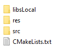
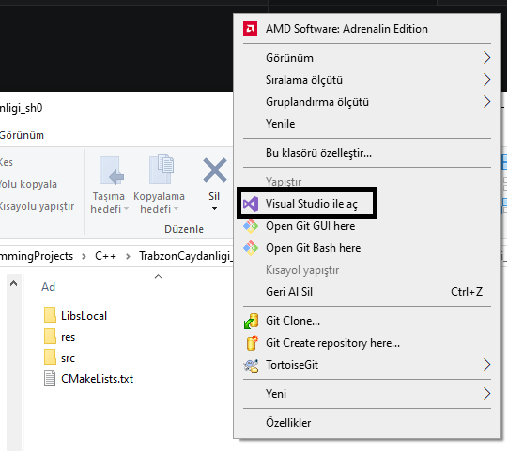

<h1> Temel atma</h1>

[Windows icin kurulum](Windows/README.md)

[Linux icin kurulum](Linux/README.md)


## Proje Yapisi



***Sekil 0.1***

Proje yapımızı şekil 0.1 görüldüğü gibi olacak
- src/ .cpp .h dosyaların tutulduğu yer
- res/ .obj, kaplamalar ve diğer kaynakların tutulduğu yer
- libsLocal/ SDL3 ve diger kutuphanelerin tutuldugu yer
  

**main.cpp**
```cpp
#include <iostream>
int main()
{
    std::cout << "hmmm... Calisiyor ilginc\n";
}
```

**CMakeLists.txt**
```Cmake
#3.15 - 4.0 versiyon araliginda cmake varsa calistir
cmake_minimum_required(VERSION 3.15...4.0)

#projenin ismi
project(TrabzonCaydanligi)

#cmake degiskenleri tanimlaniyor

#c++ versiyonu ayarlaniyor
set(CMAKE_CXX_STANDARD 20)
set(CMAKE_CXX_STANDARD_REQUIRED ON)


#supurge teknigi ile proje dosyalari MY_SOURCES icerisine atiliyor
file(GLOB_RECURSE MY_SOURCES CONFIGURE_DEPENDS "${CMAKE_CURRENT_SOURCE_DIR}/src/*.cpp")


add_executable(${PROJECT_NAME} ${MY_SOURCES})

```



Projenin bulundugu klasore sag tiklayip Visual studio ile aciyoruz projeyi derleyip calistiriyoruz.

[sonraki bolum](../01-SDL%20Kurulumu/README.md)