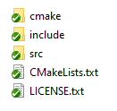

<h2> SDL pencere olusturma </h2>

- SDL kurulumu

Kaynak kodu proje/libsLocal icine atip, asagidaki sekil 1.0 belirtilen dosyalar haric gerisini cop kutusuna yolluyoruz

https://github.com/libsdl-org/SDL/releases

\
***SDL dosyasi***
\


<h4> Proje yapisi </h4>

```
Proje
|-src
|-LibsLocal
  |-SDL3
     |-cmake
     |-include
     |-src
     |-...
```


***CMakeLists.txt***
```Cmake
# 3.15 - 4.0 versiyon araliginda cmake varsa calistir
cmake_minimum_required(VERSION 3.15...4.0)

# projenin ismi
project(TrabzonCaydanligi)

# cmake degiskenleri tanimlaniyor

# c++ versiyonu ayarlaniyor
set(CMAKE_CXX_STANDARD 20)
set(CMAKE_CXX_STANDARD_REQUIRED ON)

# kutuphanelerin dosya yolu
set(LIBS_LOCAL_DIR ${CMAKE_CURRENT_SOURCE_DIR}/libsLocal)

#====================LIBS=============================================#
#=====================================================================#

# SDL kutuphanesini ekle
add_subdirectory(${LIBS_LOCAL_DIR}/SDL3 SDL_build)

#=====================================================================#
#=====================================================================#

# supurge teknigi ile proje dosyalari MY_SOURCES icerisine atiliyor
file(GLOB_RECURSE MY_SOURCES CONFIGURE_DEPENDS "${CMAKE_CURRENT_SOURCE_DIR}/src/*.cpp")


add_executable(${PROJECT_NAME} ${MY_SOURCES})

#====================LIBS=============================================#
#=====================================================================#

# Kutuphaneyi projeye bagla
target_link_libraries(${PROJECT_NAME}
    PRIVATE
    SDL3::SDL3
)

#=====================================================================#
#=====================================================================#


```


***main.cpp***
```cpp
#include <iostream>

#include "SDL3/SDL.h"

int main()
{
    SDL_Window* window = SDL_CreateWindow("TrabzonCaydanligi", 800, 600, NULL);

    std::cout << "hmmm... Calisiyor ilginc\n";

    while(1){}
}
```

***main.cpp***
```cpp
#include <iostream>

#include "SDL3/SDL.h"

const int WindowWidth = 800;
const int WindowHeight = 600;
SDL_Window* window = nullptr;

SDL_Renderer* renderer = nullptr;
bool f_running = true;

void initSDL()
{
    window = SDL_CreateWindow("TrabzonCaydanligi", WindowWidth, WindowHeight, NULL);

    if (window == nullptr)
    {
        std::cout << "HATA:: Pencere olusturulamadi\n";
        f_running = false;
    }

    renderer = SDL_CreateRenderer(window, NULL);

    if (renderer == nullptr)
    {
        std::cout << "HATA:: Renderer olusturulamadi\n";
        f_running = false;
    }

}

int main()
{
    initSDL();

    SDL_Event event;
    while(f_running)
    {
        while (SDL_PollEvent(&event))
        {
            if (event.type == SDL_EVENT_QUIT)
            {
                f_running = false;
            }

            switch (event.key.key)
            {
            case SDLK_ESCAPE:
                f_running = false;
                break;
            }
        }
    }
}
```

<== [onceki bolum](../00-Proje/README.md) 


[sonraki bolum](../02-TemelYapi/README.md) ==>