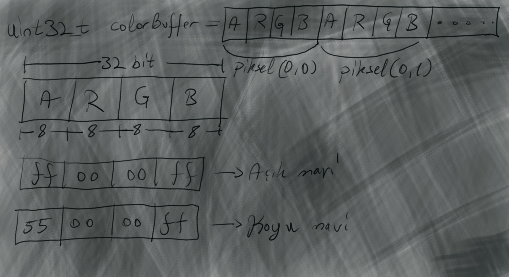

<h2>Piksel Cizimi</h2>

```cpp
using Color_t = uint32_t;
Color_t* colorBuffer = nullptr;
``` 
 Ekranda görüntülenecek piksellerin renk verisini tutacak bir boyutlu dizi oluşturalım. Bu dizideki verileri(renk degerlerini) alıp SDL kaplamasına(SDL_Texture) aktararak ekrana çizeceğiz


\
***main.cpp***
```cpp

#include <iostream>
#include <cstdint>

#include "SDL3/SDL.h"

const int WindowWidth = 800;
const int WindowHeight = 600;
SDL_Window* window = nullptr;
...
...

using Color_t = uint32_t;

Color_t* colorBuffer = nullptr;

...

int main()
{
    initSDL();

    colorBuffer = new Color_t[WindowWidth * WindowHeight];

    ...
}

```




***main.cpp***
```cpp

SDL_Texture* canvas = nullptr;

void initSDL()
{
    ...
    ...

    //RAM'de tuttuğumuz renk değerlerini(colorBuffer) ekrana çizmek için kaplama(texture) oluşturuyoruz
    canvas = SDL_CreateTexture(renderer, SDL_PIXELFORMAT_ARGB8888, SDL_TEXTUREACCESS_STREAMING, WindowWidth, WindowHeight);

    if(canvas == nullptr)
    {
        std::cout << "Error:: Texture initializing failed\n";
        f_running = false;
    }

    //Kaplamanin piksel gorunume sahip olmasi icin
    SDL_SetTextureScaleMode(canvas, SDL_SCALEMODE_NEAREST);
}
```

**main.cpp**
```cpp
/*
* @brief Renk tamponundaki tum pikseller belirtilen renk ile temizlenir
* @param color renk degeri(uint32_t)
*/
void clearColorBuffer(Color_t color)
{
    for (size_t i = 0; i < WindowWidth * WindowHeight; i++)
    {
        colorBuffer[i] = color;
    }
}

void drawColorBuffer()
{
    //Hazirladigimiz piksel dizisini ekrana cizmek icin kaplamaya(SDL_Texture* canvas) kopyaliyoruz
    
    //SDL_Texture*    : Guncellenecek hedef kaplama
    //const SDL_Rect* : Guncellenecek alan, NULL ise alanin hepsi guncellenir
    //const void*     : Piksel verisinin adresi
    //int             : Piksel verisinin bayt cinsinden satir uzunlugu
    SDL_UpdateTexture(canvas, NULL, colorBuffer, (int)(WindowWidth * sizeof(Color_t)));
    
    //Kaplamayi cizdir    
    SDL_RenderTexture(renderer, canvas, NULL, NULL);
}

void drawPixel(int x, int y, Color_t color)
{   
    //2 boyutlu dizideki piksel koordinatlarini 1 boyuta donusturup icine renk degerini atiyoruz
    //Eger bu satir anlasilmadiysa, y * w + x donusumu ile iliskili processing ornegine bakiniz              
    colorBuffer[y * WindowWidth + x] = color;
}
```


```cpp
int main()
{
    initSDL();

    colorBuffer = new Color_t[WindowWidth * WindowHeight];

    SDL_Event event;
    while(f_running)
    {
        while (SDL_PollEvent(&event))
        {
            if (event.type == SDL_EVENT_QUIT)
            {
                f_running = false;
            }

            switch (event.key.key)
            {
            case SDLK_ESCAPE:
                f_running = false;
                break;
            }
        }

        //------------------------------//
        SDL_RenderClear(renderer);

        clearColorBuffer(0xff00'00ff);

        drawColorBuffer();

        //swap buffers
        SDL_RenderPresent(renderer);
        //------------------------------//
    }
}

``` 

<h2> </h2>

Cizim ve girdi kisimlarini fonksiyonlarara ayiralim

***main.cpp***
```cpp

void draw()
{
    //------------------------------//
    SDL_RenderClear(renderer);

    clearColorBuffer(0xff00'00ff);

    drawColorBuffer();

    //swap buffers
    SDL_RenderPresent(renderer);
    //------------------------------//
}

void inputs()
{
    SDL_Event event;
    while (SDL_PollEvent(&event))
    {
        if (event.type == SDL_EVENT_QUIT)
         {
            f_running = false;
        }

        switch (event.key.key)
        {
        case SDLK_ESCAPE:
            f_running = false;
            break;
        }
    }
}

int main()
{
    initSDL();

    colorBuffer = new Color_t[WindowWidth * WindowHeight];
    
    while(f_running)
    {
        inputs();
       
        draw();                        
    }
}

```

***main.cpp***
```cpp
//Hizlica ana renkleri yazmak icin 32bit renk enumu
enum Color : uint32_t
{
    BLACK = 0x0000'0000,
    WHITE = 0xffff'ffff,
    RED   = 0xffff'0000,
    GREEN = 0xff00'ff00,
    BLUE  = 0xff00'00ff
};

int draw()
{
    //------------------------------//
    SDL_RenderClear(renderer);
    
    clearColorBuffer(Color::GREEN);

    drawColorBuffer();

    //swap buffers
    SDL_RenderPresent(renderer);
    //------------------------------//
    
}
```
<h2> </h2>

Kodun son hali

**main.cpp**
```cpp
#include <iostream>
#include <cstdint>

#include "SDL3/SDL.h"

const int WindowWidth = 800;
const int WindowHeight = 600;

SDL_Window* window = nullptr;
SDL_Renderer* renderer = nullptr;
bool f_running = true;

using Color_t = uint32_t;

Color_t* colorBuffer = nullptr;

SDL_Texture* canvas = nullptr;

enum Color : uint32_t
{
    BLACK = 0x0000'0000,
    WHITE = 0xffff'ffff,
    RED   = 0xffff'0000,
    GREEN = 0xff00'ff00,
    BLUE  = 0xff00'00ff
};

void clearColorBuffer(Color_t color)
{
    for (size_t i = 0; i < WindowWidth * WindowHeight; i++)
    {
        colorBuffer[i] = color;
    }
}

void drawColorBuffer()
{
    //Hazirladigimiz piksel dizisini ekrana cizmek icin kaplamaya(SDL_Texture* canvas) kopyaliyoruz
    
    //SDL_Texture*    : Guncellenecek hedef kaplama
    //const SDL_Rect* : Guncellenecek alan, NULL ise alanin hepsi guncellenir
    //const void*     : Piksel verisinin adresi
    //int             : Piksel verisinin bayt cinsinden satir uzunlugu
    SDL_UpdateTexture(canvas, NULL, colorBuffer, (int)(WindowWidth * sizeof(Color_t)));
    
    //Kaplamayi cizdir    
    SDL_RenderTexture(renderer, canvas, NULL, NULL);

}

void initSDL()
{
    window = SDL_CreateWindow("TrabzonCaydanligi", WindowWidth, WindowHeight, NULL);

    if (window == nullptr)
    {
        std::cout << "HATA:: Pencere olusturulamadi\n";
        f_running = false;
    }

    renderer = SDL_CreateRenderer(window, NULL);

    if (renderer == nullptr)
    {
        std::cout << "HATA:: Renderer olusturulamadi\n";
        f_running = false;
    }

    //argb_8888 formatinda ve 800x600 boyutunda kaplama(texture) olusturuluyor    
    canvas = SDL_CreateTexture(renderer, SDL_PIXELFORMAT_ARGB8888, SDL_TEXTUREACCESS_STREAMING, WindowWidth, WindowHeight);

    if(canvas == nullptr)
    {
        std::cout << "Error:: Texture initializing failed\n";
        //return false;
    }

    //Kaplamanin piksel gorunume sahip olmasi icin
    SDL_SetTextureScaleMode(canvas, SDL_SCALEMODE_NEAREST);
}

int main()
{
    initSDL();

    colorBuffer = new Color_t[WindowWidth * WindowHeight];

    SDL_Event event;
    while(f_running)
    {
        while (SDL_PollEvent(&event))
        {
            if (event.type == SDL_EVENT_QUIT)
            {
                f_running = false;
            }

            switch (event.key.key)
            {
            case SDLK_ESCAPE:
                f_running = false;
                break;
            }
        }

        SDL_RenderClear(renderer);

        clearColorBuffer(Color::GREEN);
        
        drawColorBuffer();

        //swap buffers
        SDL_RenderPresent(renderer);
    }
}
```

<== [onceki bolum](../01-SDL%20Kurulumu/README.md) 

[sonraki bolum](../03-Cizimler/README.md) ==>