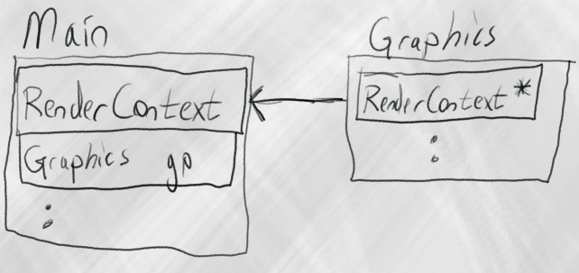

```cpp

void Graphics::drawTriangle(int x0, int y0, int x1, int y1, int x2, int y2, Color_t color)
{
    drawLine(x0, y0, x1, y1, color);
    drawLine(x1, y1, x2, y2, color);
    drawLine(x2, y2, x0, y0, color);
}

```


```cpp
void Graphics::drawRectangle(int x, int y, int width, int height, Color_t color)
{
    drawLine(x, y, x + width, y, color);
    drawLine(x + width, y, x + width, y + height, color);
    drawLine(x + width, y + height, x, y + height, color);
    drawLine(x, y + height, x, y, color);
}
```


```cpp

void Graphics::drawFilledRectangle(int x, int y, int width, int height, Color_t color)
{
    for (size_t posy = y; posy < height + y; posy++)
    {
        for (size_t posx = x; posx < width + x; posx++)
        {
            drawPixel(posx, posy, color);
        }
    }
}

```