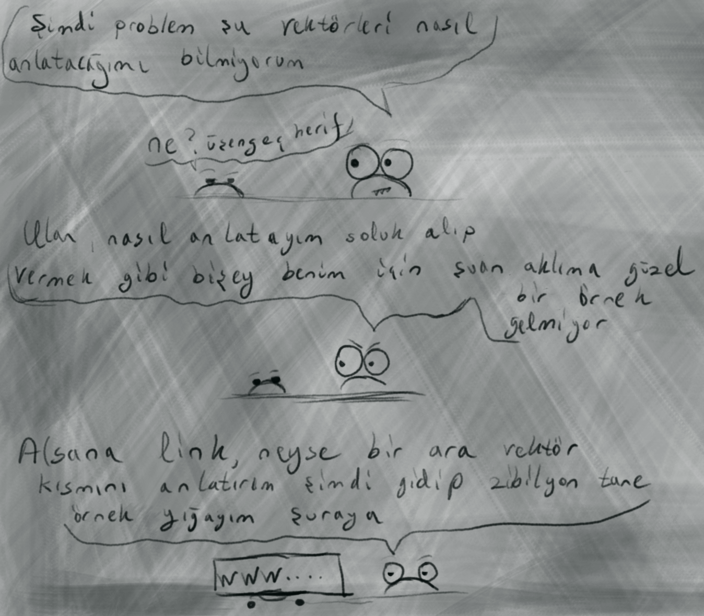

- Vektor islemleri
- Vektor ile iliskili ornekler ekle
- Processing zimbirtisi ile ornek ekle(tasinabilirlik acisindan(cmake veya make ile ugrasmamak icin) veya.. lua love? | pyhton?)
 

<h1>Vektorler</h1>

- [Kayhan Ayar C++ ile Oyun Programlamaya Giriş - Vektör ve Matematik Kütüphanesi] https://www.youtube.com/watch?v=Udvw4gJt8z8

Kayhan hoca güzel anlatmış ama burada sıklıkla kullanıcağımız iç çarpım ve nokta çarpımı ile ilişkili pek örnek vermemiş

<h1>Ornekler</h1>

- tf2
- nfs2 underground drift
- yaris pisti ornegi
