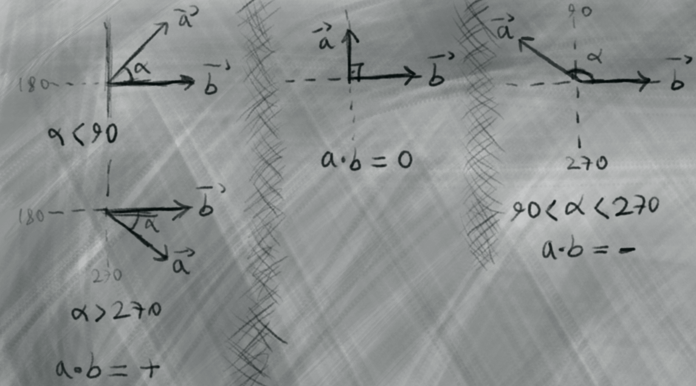
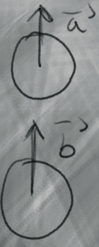
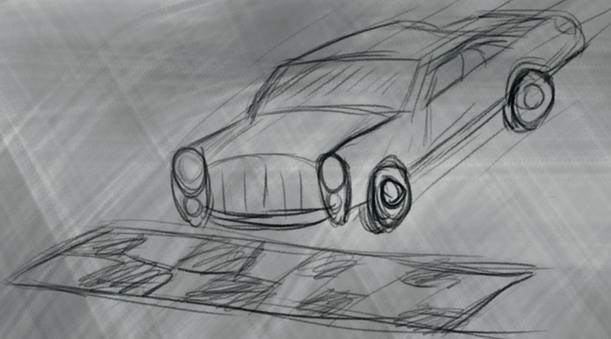
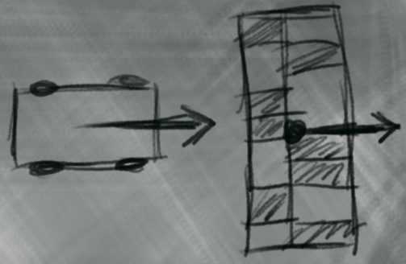

<h1>Vektörler</h1>


Temel vektör bilgisi için

[Vektorler BUders Boğaziçiliden Özel Ders](https://**www**.youtube.com/watch?v=W9QpjZip0h8&list=PLcNWqzWzYG2sQi9fY83HIdgeoVUZKPMcH&index=1)

Kayhan hoca güzel anlatmış ama burada sıklıkla kullanıcağımız iç çarpım ve nokta çarpımı ile ilişkili pek örnek vermemiş

[KayhanAyar C++ ile Oyun Programlamaya Giriş Vektör ve Matematik Kütüphanesi](https://www.youtube.com/watch?v=Udvw4gJt8z8)


<h1>Ornekler</h1>


$$
\large \text{Nokta çarpımı} = \large a \cdot b = a_x b_x + a_y b_y
$$



<h2> </h2>
- Nokta carpimi iki vektor arasindaki yon iliskisini verir. Eger vektorler ayni yone(dar aci ile) bakiyorsa sonuc pozitif
<h2> </h2>


**Ornek 6.1**

Ornegin oyuncu hedefin arkasindayken hedefe tek atsin

Bunun icin oyuncunun hedefe arkadan hasar verip vermedigini anlamak icin, oyuncunun bakis yonu ile hedefin bakis yonunun nokta carpimina bakilir 

```cpp
int dusmanCan = 100;

Vector2 oyuncuYon(1, 0);
Vector2 dusmanYon(1, 0);

float sonuc = oyuncu.dot(dusmanYon);

if(sonuc > 0.0f)
{
    can = 0;
    //diger zimbirtilar animasyon, ses vb. cagrimlari
}

```


[tf2 arkadan bicaklama mekanigi](https://wiki.teamfortress.com/wiki/Backstab)

<h2> </h2>
- yaris pisti ornegi





<h2> </h2>
- nfs2 underground drift

