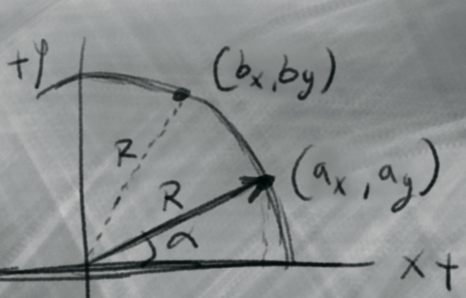
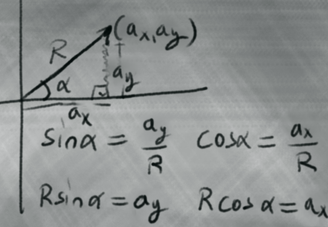
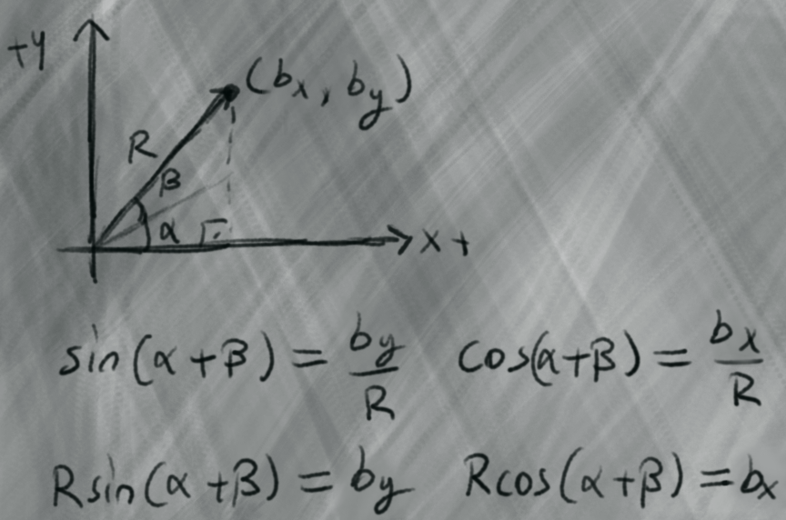
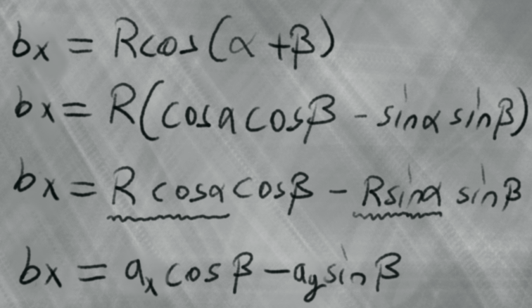
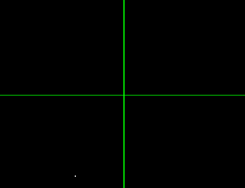
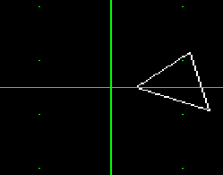

Diyelimki elimizde A(ax, ay) noktasi olsun, merkez etrafinda saat yonunun tersine beta acisi kadar dondurmek istiyoruz nasil olacak bu is



1-) A noktasinin merkezden uzakligini trigonometrik fonksiyonlar ile bulup hesapliyoruz

$$
\begin{aligned}
\large \sin(\alpha) = \frac{a_y}{R} \ \ \ => \ \ \ \large R * \sin(\alpha)= a_y
\\                                    
\large \cos(\alpha) = \frac{a_x}{R} \ \ \ => \ \ \ \large R * \cos(\alpha)= a_x 
\end{aligned}
$$



2-) 1.adimdaki ayni islem sadece A noktasinin acisina donus acisi(beta) ekleyerek uzakligi buluyoruz

$$
\begin{aligned}
\large \sin(\alpha + \beta) = \frac{b_y}{R} \ \ \ => \ \ \ \large R * \sin(\alpha + \beta)  = b_y \\
\\                                    
\large \cos(\alpha + \beta) = \frac{b_x}{R} \ \ \ => \ \ \ \large R * \cos(\alpha + \beta)  = b_x \\
\end{aligned}
$$



<h2> </h2>

[İspat: Kosinüs Açı Toplam Formülü](https://www.youtube.com/watch?v=SDLosQvgrns)

[İspat: Sinüs Açı Toplam Formülü](https://www.youtube.com/watch?v=Ihz4-rAyW04)


$$
\begin{aligned}
\large \sin(\alpha + \beta) = \sin(\alpha)\cos(\beta) + \cos(\alpha)\sin(\beta)
\\
\\
\large \cos(\alpha + \beta) = \cos(\alpha)\cos(\beta) - \sin(\alpha)\sin(\beta)
\end{aligned}
$$

<h2> </h2>

Yukardaki sin cos toplam formullerini kullanarak denklemi acarsak

<br>

$$
\large
b_x = R * \cos(\alpha + \beta)\\
$$

$$
\large
b_x = R * (\cos(\alpha)\cos(\beta) - \cos(\alpha)\sin(\beta))\\
$$

$$
\large
b_x = R\cos(\alpha)\cos(\beta) - R\sin(\alpha)\sin(\beta)\\
$$

<br>

yukarda A noktasi icin bulmus oldugumuz degerleri (x0 ve y0) yerine yerlestirirsek

$$
------------\\
\large a_x = R * \cos(\alpha)\\[3pt]
$$

$$
\large a_y = R * \sin(\alpha)\\ 
------------\\
$$
$$
\large b_x = a_x\cos(\beta) - a_y\sin(\beta)\\
$$

<br>

A noktasini ve donus acisini verdigimizde noktamizi alip saat yonunun tersine donduren formulu elde etmis oluruz


$$
\large b_x = a_x\cos(\beta) - a_y\sin(\beta)\\
$$
$$
\large b_y = a_x\sin(\beta) + a_y\cos(\beta)\\
$$


$$

\begin{bmatrix}
b_x \\
b_y
\end{bmatrix}

=

\begin{bmatrix}
\cos(\beta) & -\sin(\beta) \\
\sin(\beta) & \cos(\beta)
\end{bmatrix}

\begin{bmatrix}
a_x \\
a_y
\end{bmatrix}

$$


 

<h2> </h2>



#### [desmos ucgen ornegi](https://www.desmos.com/calculator/cemr6p7ctp)

**main.cpp**
```cpp

float x = 400, y = 400;
float alfa = 0;

void update()
{
    // float x2 = x * cos(theta) - y * sin(theta);
    // float y2 = x * sin(theta) + y * cos(theta);

    //ekranin ortasi
    float cx = rcontext.WindowWidth / 2.0f;
    float cy = rcontext.WindowHeight / 2.0f;

    //noktayi ekranin ortasina tasi
    float px = x - cx;
    float py = y - cy;

    //dondur
    float rx = px * cos(alfa) - py * sin(alfa);
    float ry = px * sin(alfa) + py * cos(alfa);

    //noktayi ekran uzayina geri donustur
    x = rx + cx;
    y = rx + cy;


    //usengeclikten f(x) => alfa++ => g(x)
    //normalde alfa += RADIAN_D90 gibi bisey yazilmasi daha iyi olur
    alfa = radToDeg(alfa);

    alfa += 0.00001;

    alfa = degToRad(alfa);
}
```


```cpp

Vector2 trig[3] = { {390,290} , {370,250}, {350,290} };

float alfa = 0;

void update()
{
    // float x2 = x * cos(theta) - y * sin(theta);
    // float y2 = x * sin(theta) + y * cos(theta);

    //ekranin ortasi
    float cx = rcontext.WindowWidth / 2.0f;
    float cy = rcontext.WindowHeight / 2.0f;

    for (size_t i = 0; i < 3; i++)
    {
        //noktayi ekranin ortasina tasi
        float px = trig[i].x - cx;
        float py = trig[i].y - cy;

        //dondur
        float rx = px * cos(alfa) - py * sin(alfa);
        float ry = px * sin(alfa) + py * cos(alfa);

        //noktayi ekran uzayina geri donustur
        trig[i].x = rx + cx;
        trig[i].y = ry + cy;
    }

    //usengeclikten f(x) => alfa++ => g(x)
    //normalde alfa += RADIAN_D90 gibi bisey yazilmasi daha iyi olur
    alfa = radToDeg(alfa);

    alfa += 0.00001f;

    alfa = degToRad(alfa);
    
}

void draw()
{

    //------------------------------//
    SDL_RenderClear(rcontext.renderer);

    gp.clearColorBuffer(Color::BLACK);

    gp.drawTriangle(
        trig[0].x, trig[0].y,
        trig[1].x, trig[1].y,
        trig[2].x, trig[2].y,
        Color::WHITE);

    gp.drawLine(0, rcontext.WindowHeight / 2, rcontext.WindowWidth, rcontext.WindowHeight / 2, Color::GREEN);

    gp.drawLine(rcontext.WindowWidth / 2,0, rcontext.WindowWidth / 2, rcontext.WindowHeight, Color::GREEN);

    gp.drawDots(Color::GREEN);

    gp.drawColorBuffer();

    //swap buffers
    SDL_RenderPresent(rcontext.renderer);
    //------------------------------//
}

```
