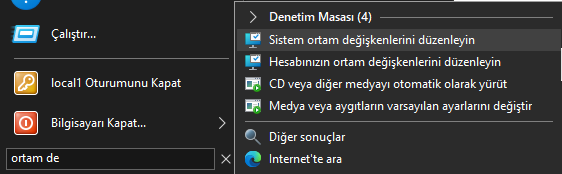
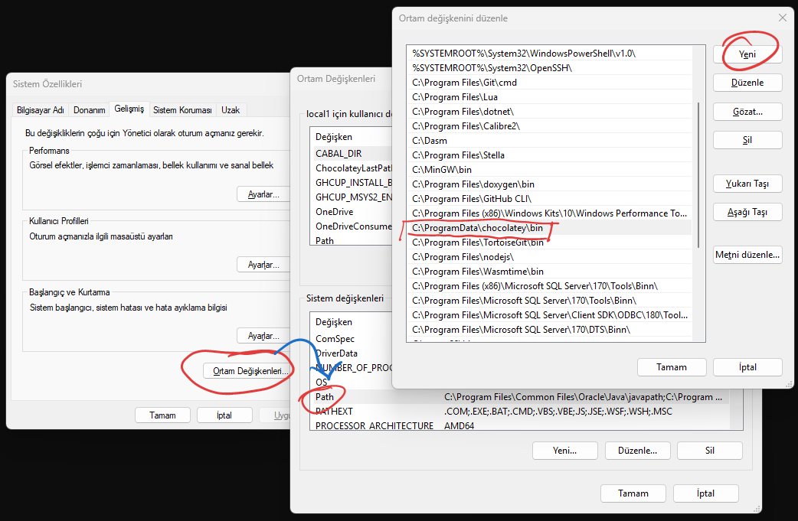
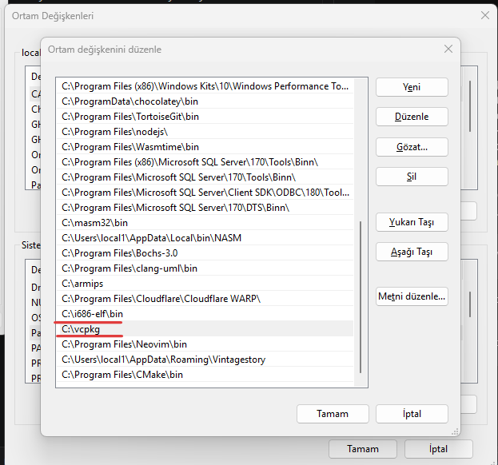
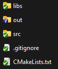
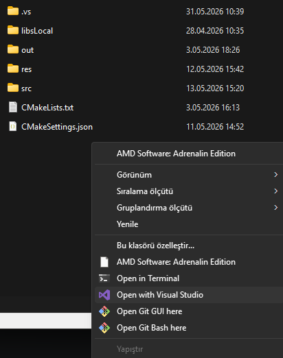
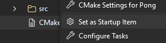
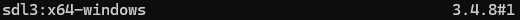
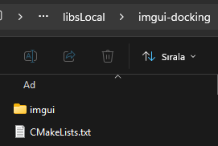
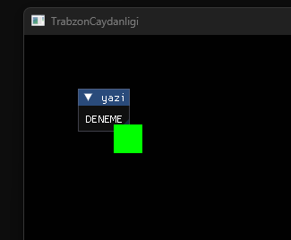

**Gerekli araclar**


***sekil 0.0***

  - Visual Studio kurulum aracindan Sekil 0.0 da gorulmekte olan zimbirtiyi isaretleyip indiriyoruz

  <h2>chocolatey kurulumu</h2>

  https://chocolatey.org/install

  PowerShell i yonetici olarak calistirdiktan sonra, Chocolatey yi kurmak icin asagidaki komutu giriyoruz.
  
  ```PowerShell

  Set-ExecutionPolicy Bypass -Scope Process -Force; [System.Net.ServicePointManager]::SecurityProtocol = [System.Net.ServicePointManager]::SecurityProtocol -bor 3072; iex ((New-Object System.Net.WebClient).DownloadString('https://community.chocolatey.net/install.ps1'))

  ```

  choco kurulduktan sonra sistem degiskenlerine ekleyelim

  
  

  
  Agasidaki proje insaat zimbirtilarini indirmek icin su komutlari yaziyoruz

  makefile
  ```
  choco install make -y
  ```

  ninja

  ```
  choco install ninja -y
  ```

  cmake

  ```
  choco install cmake -y
  ```

Belki ilerde versiyon sikintisi olur diye soyle cikolata listemi yaziyim


<h2>vcpkg </h2>

[vcpkg](https://github.com/microsoft/vcpkg) paket yonetim sistemi bilgisayarda uygun buldugumuz yere indiriyoruz ve sistem degiskenlerine ekleyiyoruz

```
git clone https://github.com/microsoft/vcpkg.git
```



Kurduktan sonra su .bat dosyasini calistiriyoruz

```
vcpkg/bootstrap-vcpkg.bat
```

<h2>Temel yapi</h2>

[hazir yapi](https://github.com/onuryucel-8bit/TrabzonCaydanligi_sh1/releases/tag/v0.3)

## Proje Yapisi



***Sekil 0.1***

Proje yapımızı şekil 0.1 görüldüğü gibi olacak
- src/ .cpp .h dosyaların tutulduğu yer
- res/ .obj, kaplamalar ve diğer kaynakların tutulduğu yer
- libsLocal/ kutuphanelerin (header-only[imgui - glm - stb_image vb.]) tutuldugu yer


**CMakeLists.txt**
```Cmake
cmake_minimum_required(VERSION 3.15)

#projenin ismi
project(TrabzonCaydanligi)

#cmake degiskenleri tanimlaniyor

#c++ versiyonu ayarlaniyor
set(CMAKE_CXX_STANDARD 20)
set(CMAKE_CXX_STANDARD_REQUIRED ON)

#=========================================================#
#=========================================================#
#=========================================================#

#supurge teknigi ile proje dosyalari MY_SOURCES icerisine atiliyor
file(GLOB_RECURSE MY_SOURCES CONFIGURE_DEPENDS "${CMAKE_CURRENT_SOURCE_DIR}/src/*.cpp")


add_executable(${PROJECT_NAME} ${MY_SOURCES})

#=========================================================#
#=========================================================#
#=========================================================#
```

**src/main.cpp**
```cpp
#include <iostream>
int main()
{
    std::cout << "hmmm... Calisiyor ilginc\n";
}
```

main.cpp ve cmakelist.txt yazdiktan sonra projeyi acip



cmakelist.txt dosyasina sag tiklayip atesleyici olarak secip projeyi calistiralim



<h2>SDL kurulumu</h2>

cmd yi acip vcpkg araciligiyla sdl3 u kuruyoruz

```
vcpkg install sdl3
```

```
vcpkg list
```
suan bende kurulu olan sdl3 versiyonu




```Cmake
cmake_minimum_required(VERSION 3.15)

set(CMAKE_TOOLCHAIN_FILE "C:/vcpkg/scripts/buildsystems/vcpkg.cmake")

# projenin ismi
project(TrabzonCaydanligi)

# cmake degiskenleri tanimlaniyor

# c++ versiyonu ayarlaniyor
set(CMAKE_CXX_STANDARD 20)
set(CMAKE_CXX_STANDARD_REQUIRED ON)

# Dinamik baglantiyi kes
set(SDL_SHARED OFF CACHE BOOL "Dinamik bagla:: Dinamik zimbirti" FORCE)
# Statik baglantiyi aktif hale getir
set(SDL_STATIC ON CACHE BOOL "Statik bagla:: Statik Dolma Pilavi" FORCE)


#====================LIBS=============================================#
#=====================================================================#

# kutuphaneler
find_package(SDL3 CONFIG REQUIRED)

#=====================================================================#
#=====================================================================#

# supurge teknigi ile proje dosyalari MY_SOURCES icerisine atiliyor
file(GLOB_RECURSE MY_SOURCES CONFIGURE_DEPENDS "${CMAKE_CURRENT_SOURCE_DIR}/src/*.cpp")

add_executable(${PROJECT_NAME} ${MY_SOURCES})

#====================LIBS=============================================#
#=====================================================================#

target_link_libraries(${PROJECT_NAME}
    PRIVATE
    SDL3::SDL3
)

#=====================================================================#
#=====================================================================#
```

**main.cpp**
```cpp
#include <iostream>

#include "SDL3/SDL.h"

const int WindowWidth = 800;
const int WindowHeight = 600;
SDL_Window* window = nullptr;

SDL_Renderer* renderer = nullptr;
bool f_running = true;

void initSDL()
{
    window = SDL_CreateWindow("TrabzonCaydanligi", WindowWidth, WindowHeight, NULL);

    if (window == nullptr)
    {
        std::cout << "HATA:: Pencere olusturulamadi\n";
        f_running = false;
    }

    renderer = SDL_CreateRenderer(window, NULL);

    if (renderer == nullptr)
    {
        std::cout << "HATA:: Renderer olusturulamadi\n";
        f_running = false;
    }

}

int main()
{
    initSDL();

    SDL_SetWindowAlwaysOnTop(window, true);

    SDL_Event event;
    while(f_running)
    {
        while (SDL_PollEvent(&event))
        {
            if (event.type == SDL_EVENT_QUIT)
            {
                f_running = false;
            }

            switch (event.key.key)
            {
            case SDLK_ESCAPE:
                f_running = false;
                break;
            }
        }

        SDL_SetRenderDrawColor(renderer, 0, 0, 255, 255);
        SDL_RenderClear(renderer);


        SDL_FRect rect = { 100, 100, 32,32 };
        SDL_SetRenderDrawColor(renderer, 0, 255, 0, 255);
        SDL_RenderFillRect(renderer, &rect);

        //swap buffers
        SDL_RenderPresent(renderer);
    }
}
```

<h2>imgui kurulumu</h2>

[imgui-docking](https://github.com/ocornut/imgui/releases/tag/v1.92.7-docking) indirdikten sonra ismini imgui yapip libsLocal klasorunun icine koyuyoruz



**libsLocal/imgui-docking/CMakeLists.txt**
```Cmake
cmake_minimum_required(VERSION 3.15...4.0)
project(imgui)

add_library(imgui)
target_sources(imgui PRIVATE 
"${CMAKE_CURRENT_SOURCE_DIR}/imgui/imgui.cpp"
"${CMAKE_CURRENT_SOURCE_DIR}/imgui/imgui_demo.cpp"
"${CMAKE_CURRENT_SOURCE_DIR}/imgui/imgui_draw.cpp"
"${CMAKE_CURRENT_SOURCE_DIR}/imgui/imgui_tables.cpp"
"${CMAKE_CURRENT_SOURCE_DIR}/imgui/imgui_widgets.cpp"
"${CMAKE_CURRENT_SOURCE_DIR}/imgui/backends/imgui_impl_sdl3.cpp"
"${CMAKE_CURRENT_SOURCE_DIR}/imgui/backends/imgui_impl_sdlrenderer3.cpp"
)

target_include_directories(imgui PUBLIC "${CMAKE_CURRENT_SOURCE_DIR}/imgui")

target_link_libraries(imgui PUBLIC SDL3::SDL3)
```

**CMakeLists.txt**
```Cmake
cmake_minimum_required(VERSION 3.15)

set(CMAKE_TOOLCHAIN_FILE "C:/vcpkg/scripts/buildsystems/vcpkg.cmake")

# projenin ismi
project(TrabzonCaydanligi)

# cmake degiskenleri tanimlaniyor

# c++ versiyonu ayarlaniyor
set(CMAKE_CXX_STANDARD 20)
set(CMAKE_CXX_STANDARD_REQUIRED ON)

# Dinamik baglantiyi kes
set(SDL_SHARED OFF CACHE BOOL "Dinamik bagla:: Dinamik zimbirti" FORCE)
# Statik baglantiyi aktif hale getir
set(SDL_STATIC ON CACHE BOOL "Statik bagla:: Statik Dolma Pilavi" FORCE)


#====================LIBS=============================================#
#=====================================================================#

# kutuphanelerin dosya yolu
set(LIBS_LOCAL_DIR ${CMAKE_CURRENT_SOURCE_DIR}/libsLocal)

# kutuphaneler
find_package(SDL3 CONFIG REQUIRED)

add_subdirectory(${LIBS_LOCAL_DIR}/imgui-docking imgui_build)

#=====================================================================#
#=====================================================================#

# supurge teknigi ile proje dosyalari MY_SOURCES icerisine atiliyor
file(GLOB_RECURSE MY_SOURCES CONFIGURE_DEPENDS "${CMAKE_CURRENT_SOURCE_DIR}/src/*.cpp")

add_executable(${PROJECT_NAME} ${MY_SOURCES})

#====================LIBS=============================================#
#=====================================================================#

target_link_libraries(${PROJECT_NAME}
    PRIVATE
    SDL3::SDL3
    imgui
)

#=====================================================================#
#=====================================================================#
```

**main.cpp**
```cpp
#include <iostream>

#include "SDL3/SDL.h"

#include "imgui.h"
#include "backends/imgui_impl_sdl3.h"
#include "backends/imgui_impl_sdlrenderer3.h"

const int WindowWidth = 800;
const int WindowHeight = 600;
SDL_Window* window = nullptr;

SDL_Renderer* renderer = nullptr;
bool f_running = true;

ImGuiIO* io;

void initImgui()
{
    IMGUI_CHECKVERSION();
    ImGui::CreateContext();

    io = &ImGui::GetIO();

    // Enable Docking
    io->ConfigFlags |= ImGuiConfigFlags_DockingEnable;
    io->FontGlobalScale = 1;

    ImGui_ImplSDL3_InitForSDLRenderer(window, renderer);
    ImGui_ImplSDLRenderer3_Init(renderer);
}

void initSDL()
{
    window = SDL_CreateWindow("TrabzonCaydanligi", WindowWidth, WindowHeight, NULL);

    if (window == nullptr)
    {
        std::cout << "HATA:: Pencere olusturulamadi\n";
        f_running = false;
    }

    renderer = SDL_CreateRenderer(window, NULL);

    if (renderer == nullptr)
    {
        std::cout << "HATA:: Renderer olusturulamadi\n";
        f_running = false;
    }    

    SDL_SetWindowAlwaysOnTop(window, true);
}

void inputs()
{
    SDL_Event event;
    while (SDL_PollEvent(&event))
    {
        ImGui_ImplSDL3_ProcessEvent(&event);

        if (event.type == SDL_EVENT_QUIT)
        {
            f_running = false;
        }

        switch (event.key.key)
        {
        case SDLK_ESCAPE:
            f_running = false;
            break;
        }
    }
}

void drawImgui()
{
    ImGui_ImplSDLRenderer3_NewFrame();
    ImGui_ImplSDL3_NewFrame();
    ImGui::NewFrame();
    //===================================================//
    //===================================================//
    //===================================================//

    ImGui::Begin("yazi");

    ImGui::Text("DENEME");

    ImGui::End();


    //===================================================//
    //===================================================//
    //===================================================//

    ImGui::Render();
    ImGui_ImplSDLRenderer3_RenderDrawData(ImGui::GetDrawData(), renderer);
}

void draw()
{
    SDL_FRect rect = { 100, 100, 32,32 };
    SDL_SetRenderDrawColor(renderer, 0, 255, 0, 255);
    SDL_RenderFillRect(renderer, &rect);
}

void update()
{

}

int main()
{
    initSDL();
    initImgui();
  
    while(f_running)
    {
        inputs();

        update();

        SDL_SetRenderDrawColor(renderer, 0, 0, 0, 255);
        SDL_RenderClear(renderer);
        drawImgui();
        draw();
        //swap buffers
        SDL_RenderPresent(renderer);
    }
}
```

