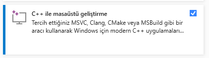

**Gerekli araclar**



***sekil 0.0***

  - Visual Studio kurulum aracindan Sekil 0.0 da gorulmekte olan zimbirtiyi isaretleyip indiriyoruz

- cmake https://cmake.org/download/
     linke tiklayip cmake i kuruyoruz (Windows icin PATH eklenmesi gerekmektedir)


- makefile/ninja
  https://chocolatey.org/install


  <h3>chocolatey kurulumu</h3>

  PowerShell i yonetici olarak calistirdiktan sonra, Chocolatey yi kurmak icin asagidaki komutu giriyoruz.
  
  ```PowerShell

  Set-ExecutionPolicy Bypass -Scope Process -Force; [System.Net.ServicePointManager]::SecurityProtocol = [System.Net.ServicePointManager]::SecurityProtocol -bor 3072; iex ((New-Object System.Net.WebClient).DownloadString('https://community.chocolatey.net/install.ps1'))

  ```
  choco kurulduktan sonra agasidaki zimbirtilari yaziyoruz

  makefile
  ```
  choco install make -y
  ```

  ninja

  ```
  choco install ninja -y
  ```
