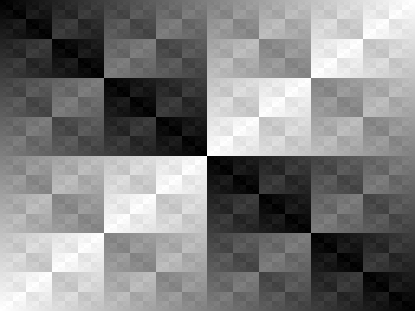

https://lodev.org/cgtutor/xortexture.html

***xor kaplama***
```cpp

for (size_t x = 0; x < WindowWidth; x++)
{
    for (size_t y = 0; y < WindowHeight; y++)
    {
        uint8_t xorColor = x ^ y;

        //0xAARR_GGBB
               
        Color_t color = (0xff << 24) | (xorColor << 16) | (xorColor << 8) | xorColor;

        drawPixel(x, y, color);
    }
}

```



```cpp

 for (size_t x = 0; x < WindowWidth; x++)
 {
     for (size_t y = 0; y < WindowHeight; y++)
     {
         uint8_t c = sin(x * y) * 100 ;

         //0xAARR_GGBB
         
         //0xffcc_cccc
         //cc = xorcolor
         Color_t color = (0xff << 24) | (c << 16) | (c << 8) | c;

         drawPixel(x, y, color);
     }
 }
```


```cpp

for (int y = 0; y < rcontext.WindowHeight; y++) 
{
    for (int x = 0; x < rcontext.WindowWidth; x++) 
    {                     
        Color_t color = cos(sqrt(x)) * Color::GREEN;
        gp.drawPixel(x, y, color);
    }
}

```


```cpp
for (int y = 0; y < rcontext.WindowHeight; y++) 
{
    for (int x = 0; x < rcontext.WindowWidth; x++) 
    {                     
        Color_t color = log(x) * cos(y) * Color::GREEN;
        gp.drawPixel(x, y, color);
    }
}
```


```cpp
for (int y = 0; y < rcontext.WindowHeight; y++) 
{
    for (int x = 0; x < rcontext.WindowWidth; x++) 
    {                     
        Color_t color = log(x ^ y)  * Color::GREEN;
        gp.drawPixel(x, y, color);
    }
}
```


```cpp

for (int y = 0; y < rcontext.WindowHeight; y++) 
{
    for (int x = 0; x < rcontext.WindowWidth; x++) 
    {                     
        Color_t color = log(x | y)   * Color::GREEN;
        gp.drawPixel(x, y, color);
    }
}

```


<== [onceki bolum](../02-TemelYapi/README.md)

[sonraki bolum](../04-Cizgi%20Algoritmalari/README.md) ==>