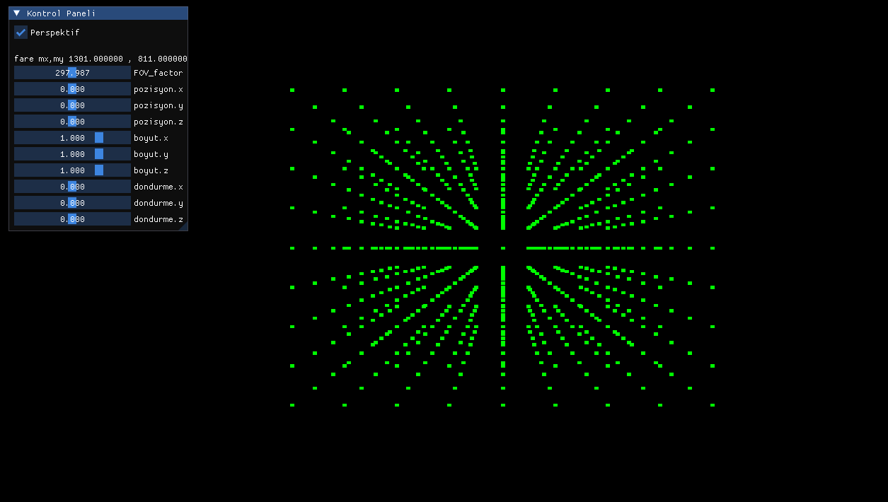

<h2>Noktanin Ekrana Izdusumu</h2>


<h2> </h2>

***v0.1***


nokta koordinalari yukleniyor
```cpp
void loadCube()
{
    float incz = 0.20f;
    float incy = 0.20f;
    float incx = 0.20f;

    for (float z = -1; z <= 1.0f; z += incz)
    {
        for (float y = -1; y <= 1.0f; y += incy)
        {
            for (float x = -1; x <= 1.0f; x+= incx)
            {
                Vector3 vec(x, y, z);

                modelPoints.push_back(vec);
            }
        }
    }    
}
```

Blender perspektif ornegi ekle


```cpp
Vector2 projectOrtho(Vector3 vec)
{
    return Vector2
    { 
        vec.x * FOV_factor,
        vec.y * FOV_factor
    };
}

Vector2 projectPerspective(Vector3 vec)
{
    return Vector2
    {
        (vec.x * FOV_factor) / vec.z,
        (vec.y * FOV_factor) / vec.z
    };
}

Vector2 project(Vector3 vec)
{
    if (f_proj)
    {
        return projectPerspective(vec);
    }
    return projectOrtho(vec);
}

void drawImgui()
{
    ImGui_ImplSDLRenderer3_NewFrame();
    ImGui_ImplSDL3_NewFrame();
    ImGui::NewFrame();
    
    ImGui::Begin("Kontrol Paneli");
        
    ImGui::Checkbox("Perspektif", &f_proj);

    ImGui::NewLine();
    ImGui::Text("Ekran mx,my %f , %f",mouseX , mouseY);
  
    ImGui::End();

    ImGui::Render();
    ImGui_ImplSDLRenderer3_RenderDrawData(ImGui::GetDrawData(), rcontext.renderer);
}
```

```cpp
initSDL()
{
    ...
    ...

    loadCube();
    projectedPoints.resize(modelPoints.size());

}
```

```cpp
void draw()
{
    //------------------------------//    

    gp.clearColorBuffer(Color::BLACK);    

    //gp.drawDots(Color::GREEN);

    for (size_t i = 0; i < projectedPoints.size(); i++)
    {
        gp.drawFilledRectangle(
            projectedPoints[i].x,
            projectedPoints[i].y,
            3,
            3,
            Color::GREEN
        );
    }

    gp.drawColorBuffer();
    
    //------------------------------//
} 
```

<h2> </h2>

***v0.2***



```cpp
Vector3 position(0, 0, 0);
Vector3 scale(1.0f, 1.0f, 1.0f);
Vector3 rotate(0, 0, 0);
```

```cpp
void update()
{        
    for (size_t i = 0; i < modelPoints.size(); i++)
    {
        Vector3 point = modelPoints[i];

        point.z -= camera.position.z;

        //vektor carpimi ekle a * b operator*(...);
        point.x = point.x * scale.x;
        point.y = point.y * scale.y;
        point.z = point.z * scale.z;

        point = point.rotateX(rotate.x);
        point = point.rotateY(rotate.y);
        point = point.rotateZ(rotate.z);
        


        point = point + position;
      
        /*
        * point = scale(point);
        * point = rotate(point);
        * point = translate(point);
        */

        projectedPoints[i] = project(point);

        projectedPoints[i].x += rcontext.WindowWidth / 2;
        projectedPoints[i].y += rcontext.WindowHeight / 2;
    }
}
```

```cpp
void drawImgui()
{
    ImGui_ImplSDLRenderer3_NewFrame();
    ImGui_ImplSDL3_NewFrame();
    ImGui::NewFrame();
    
    ImGui::Begin("Kontrol Paneli");
    
    ImGui::Checkbox("Perspektif", &f_proj);

    ImGui::NewLine();
    ImGui::Text("fare mx,my %f , %f",mouseX , mouseY);

    ImGui::SliderFloat("FOV_factor", &FOV_factor, 0, 600);

    ImGui::SliderFloat("pozisyon.x", &position.x, -2, 2);
    ImGui::SliderFloat("pozisyon.y", &position.y, -2, 2);
    ImGui::SliderFloat("pozisyon.z", &position.z, -2, 2);
  
    ImGui::SliderFloat("boyut.x", &scale.x, -2, 2);
    ImGui::SliderFloat("boyut.y", &scale.y, -2, 2);
    ImGui::SliderFloat("boyut.z", &scale.z, -2, 2);

    ImGui::SliderFloat("dondurme.x", &rotate.x, -2, 2);
    ImGui::SliderFloat("dondurme.y", &rotate.y, -2, 2);
    ImGui::SliderFloat("dondurme.z", &rotate.z, -2, 2);

    ImGui::End();

    ImGui::Render();
    ImGui_ImplSDLRenderer3_RenderDrawData(ImGui::GetDrawData(), rcontext.renderer);
}
```

<h2> </h2>

***V0.3***

cizgiler ile kup cizimi


<h2> </h2>
ucgenler ile kup cizimi

<h2> </h2>

- koordinat duzlemini yazmayi unutma x-y-z sag-sol el kurali
- dondurme
- indeks tamponu ekle
- obj dosya okuyucu
- main yapisini tasi
- derinlik siralamasi
- eski legacy opengl ile baglantiyi anlat 