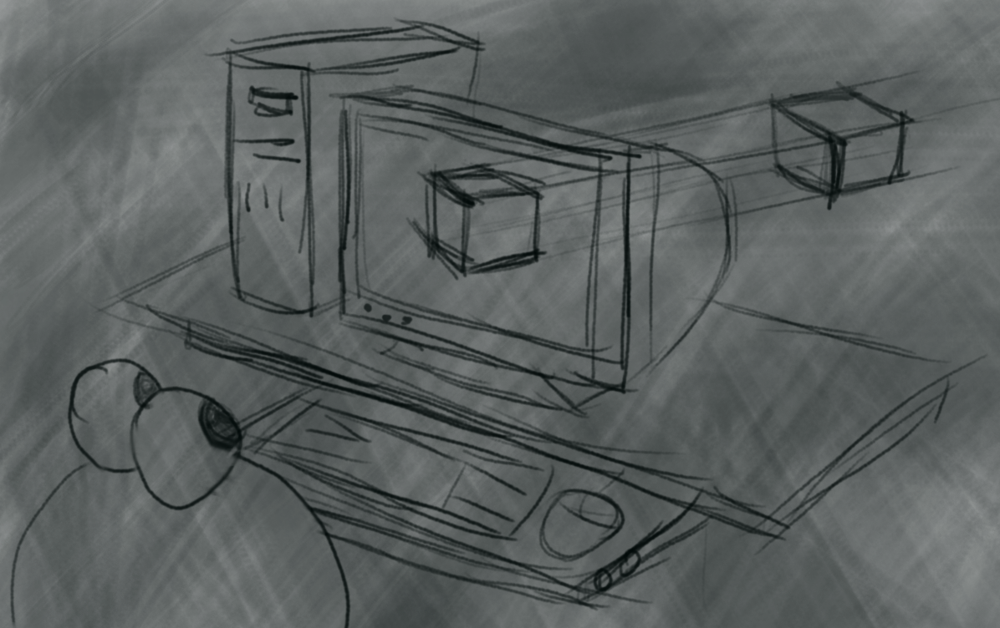

<h2>Noktanin Ekrana Izdusumu</h2>

Elimizde bir nokta bulutu bulutu, kup veya kete modeli olsun bunu iki boyutlu ekrana yansitmak icin kullanilan iki yontem vardir (balik gozu, izometrik izdusum gibi farkli yontemler bulunsa da genellikle bu ikisi kullanilir)

1. Ortografik Izdusum
2. Perspektif Izdusum

<h2>Koordinat Duzlemi</h2>

Noktalari ekrana yansitmadan once koordinat duzlemimiz asagida goruldugu gibi 
- X ekseni **saga** dogru pozitif
- Y ekseni **yukari** dogru pozitif
- Z ekseni ekranin **icine** dogru pozitif

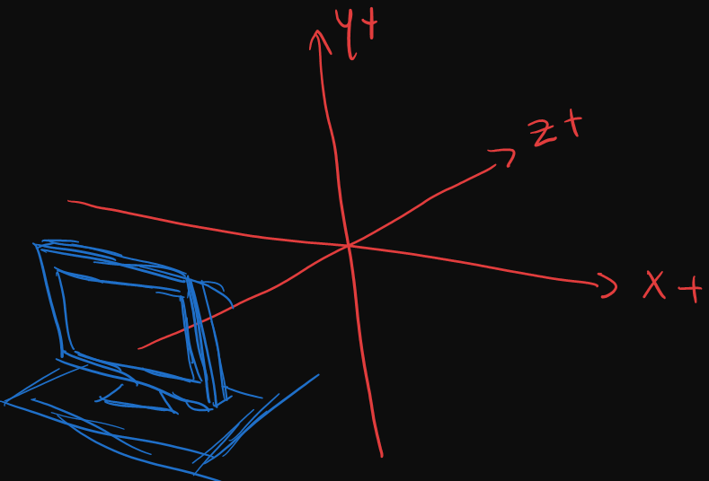

Ekrana yansıtılacak nokta bulutu
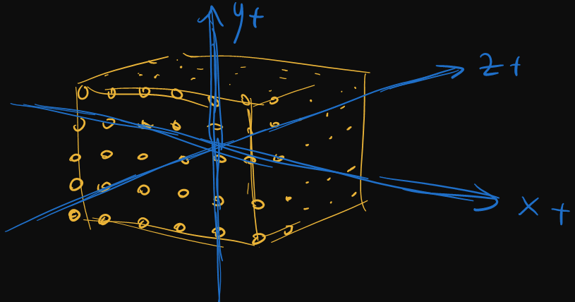
```cpp
//nokta koordinatlari yukleniyor
void loadCube()
{
    float incz = 0.20f;
    float incy = 0.20f;
    float incx = 0.20f;

    for (float z = -1; z <= 1.0f; z += incz)
    {
        for (float y = -1; y <= 1.0f; y += incy)
        {
            for (float x = -1; x <= 1.0f; x+= incx)
            {
                Vector3 vec(x, y, z);

                modelPoints.push_back(vec);
            }
        }
    }    
}
```


<h2>1-) Ortografik Izdusum </h2>

Bu yontemde nesnenin z (derinlik) boyutu gormezden gelinerek izdusum alınır

***main.cpp***
```cpp

struct Camera
{
    //Kamerayi kup bulutundan 3 birim geriye aliyoruz
    Vector3 position = {0.0f, 0.0f, -3.0f};
    float FOV_factor = 300;
};

Camera camera;

std::vector<Vector3> modelPoints;
std::vector<Vector2> projectedPoints;

Vector2 projectOrtho(Vector3 vec)
{
    return Vector2
    { 
        //FOV_factor: gelen koordinatlar -1,1 gibi dar bir aralikta olucagi icin
        //bu degerleri ekrana uygun sekilde buyutmemiz gerekiyor
        vec.x * camera.FOV_factor,
        vec.y * camera.FOV_factor
    };
}

void update()
{   
    //Ekrana yansitilacak nokta dizisi bosaltiliyor     
    projectedPoints.clear();

    for (size_t i = 0; i < modelPoints.size(); i++)
    {
        Vector3 point = modelPoints[i];
                
        //Noktalari 3 birim kameradan uzaklastiriyoruz
        point.z -= camera.position.z;

        //Ekrana nokta bulutunun noktalari yansitiliyor
        projectedPoints[i] = project(point);

        //Yansitilan noktalar ekrana ortalaniyor
        projPoint.x += rcontext.WindowWidth / 2;
        projPoint.y += rcontext.WindowHeight / 2;

        projectedPoints.emplace_back(projPoint);
    }
}

void draw()
{
    //------------------------------//    

    gp.clearColorBuffer(Color::BLACK);    
    
    for (size_t i = 0; i < projectedPoints.size(); i++)
    {
        gp.drawFilledRectangle(
            projectedPoints[i].x,
            projectedPoints[i].y,
            3,
            3,
            Color::GREEN
        );
    }

    gp.drawColorBuffer();
    
    //------------------------------//
}
```

Proje boyunca asagidaki gibi model noktalari dinamik **vector3** dizisi icine konulup izdusum(ortografik veya perspektif) fonksiyonlarina aktarilacak, elde edilen izdusum noktalari **vector2** dinamik dizisi icine yerlestirilip  ekrana cizilicektir


***0-Perpektif ve Ortografik Izdusum***

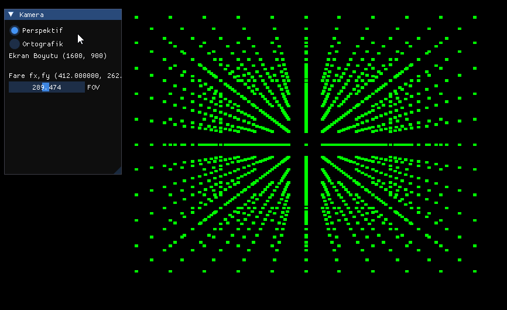

<h2>2-) Perspektif Izdusumu</h2>

A noktasindan ekrana uzakligimiz 1 olsun 
- P noktasi karelerden birinin pozisyonu 
- P` ise ekrana izdusumu

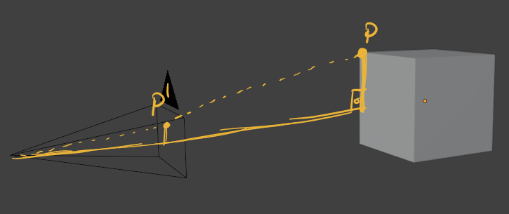

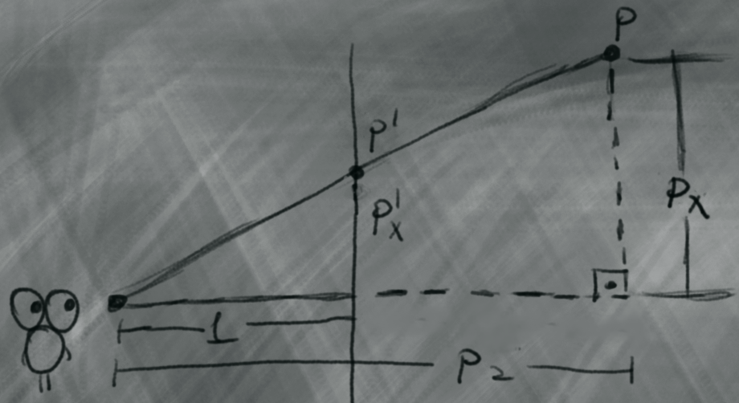

P` noktasinin ekrandaki x koordinati Aci-Aci benzerligi ile buluruz

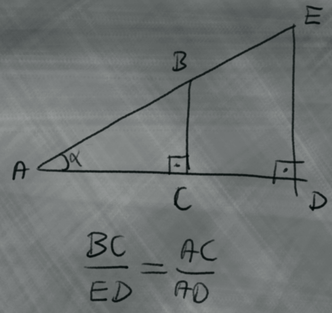

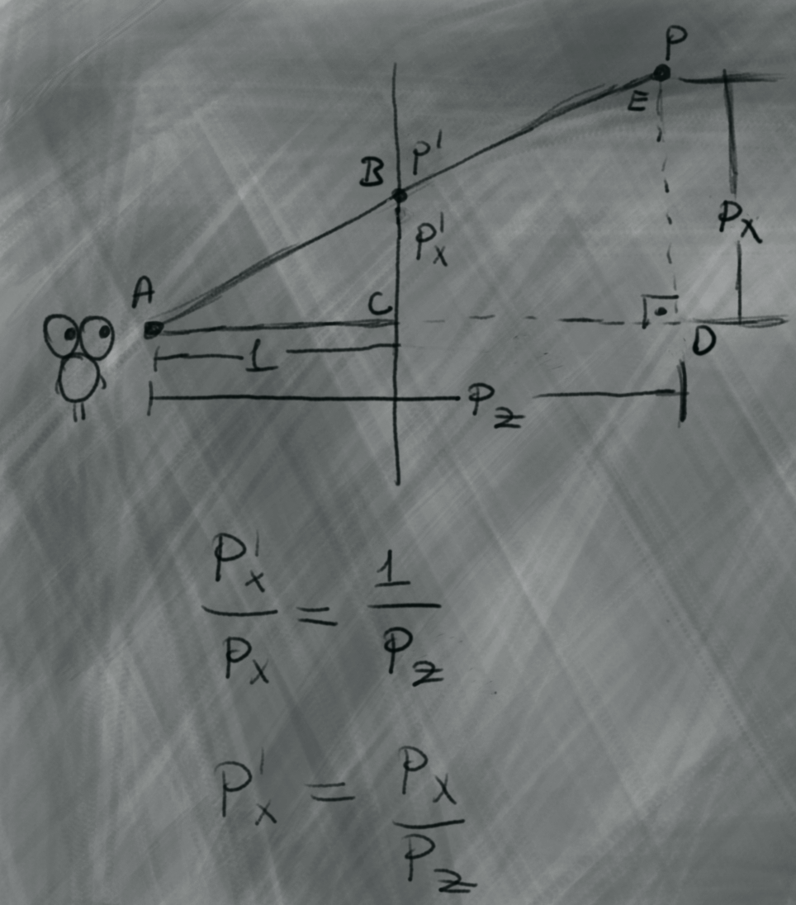

Ayni islemi noktanin Y izdusumu icin de yapiyoruz

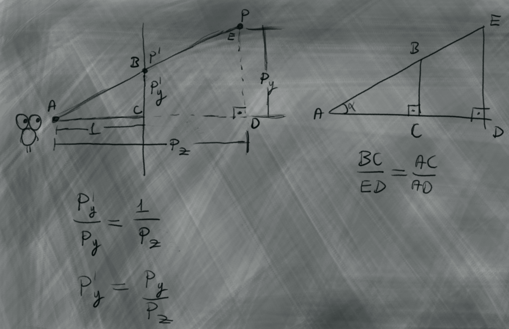

**Perspektif Izdusum Denklemi**

$$
\Large P`_x = \frac{P_x}{P_z} 
$$

$$
\Large P`_y = \frac{P_y}{P_z} 
$$

<h2> </h2>

```cpp

enum class ProjectMod
{
    Ortho,
    Perspective
};

ProjectMod projectMod = ProjectMod::Perspective;


Vector2 projectOrtho(Vector3 vec)
{
    //FOV_factor: gelen koordinatlar -1,1 gibi dar bir aralikta olucagi icin
    //bu degerleri ekrana uygun sekilde buyutmemiz gerekiyor
    return Vector2
    { 
        vec.x * camera.FOV_factor,
        vec.y * camera.FOV_factor
    };
}

Vector2 projectPerspective(Vector3 vec)
{
    return Vector2
    {
        (vec.x * camera.FOV_factor) / vec.z,
        (vec.y * camera.FOV_factor) / vec.z
    };
}

Vector2 project(Vector3 vec)
{
    if (projectMod == ProjectMod::Perspective)
    {
        return projectPerspective(vec);
    }
    return projectOrtho(vec);
}
```

<h2> </h2>

***v0.2***

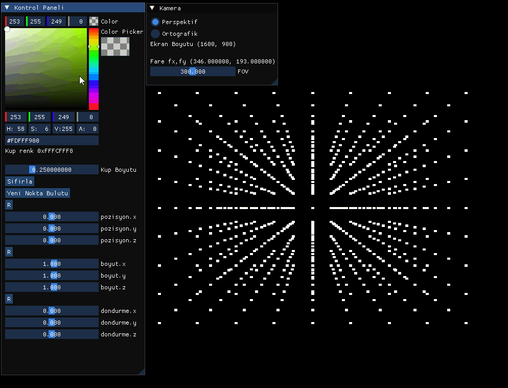

```cpp
Vector3 position(0, 0, 0);
Vector3 scale(1.0f, 1.0f, 1.0f);
Vector3 rotate(0, 0, 0);
```

```cpp
void update()
{        
    for (size_t i = 0; i < modelPoints.size(); i++)
    {
        Vector3 point = modelPoints[i];

        point.z -= camera.position.z;

        //vektor carpimi ekle a * b operator*(...);
        point.x = point.x * scale.x;
        point.y = point.y * scale.y;
        point.z = point.z * scale.z;

        point = point.rotateX(rotate.x);
        point = point.rotateY(rotate.y);
        point = point.rotateZ(rotate.z);
        


        point = point + position;
      
        /*
        * point = scale(point);
        * point = rotate(point);
        * point = translate(point);
        */

        projectedPoints[i] = project(point);

        projectedPoints[i].x += rcontext.WindowWidth / 2;
        projectedPoints[i].y += rcontext.WindowHeight / 2;
    }
}
```

```cpp
void drawImgui()
{
    ImGui_ImplSDLRenderer3_NewFrame();
    ImGui_ImplSDL3_NewFrame();
    ImGui::NewFrame();
    
    ImGui::Begin("Kontrol Paneli");
    
    ImGui::Checkbox("Perspektif", &f_proj);

    ImGui::NewLine();
    ImGui::Text("fare mx,my %f , %f",mouseX , mouseY);

    ImGui::SliderFloat("FOV_factor", &FOV_factor, 0, 600);

    ImGui::SliderFloat("pozisyon.x", &position.x, -2, 2);
    ImGui::SliderFloat("pozisyon.y", &position.y, -2, 2);
    ImGui::SliderFloat("pozisyon.z", &position.z, -2, 2);
  
    ImGui::SliderFloat("boyut.x", &scale.x, -2, 2);
    ImGui::SliderFloat("boyut.y", &scale.y, -2, 2);
    ImGui::SliderFloat("boyut.z", &scale.z, -2, 2);

    ImGui::SliderFloat("dondurme.x", &rotate.x, -2, 2);
    ImGui::SliderFloat("dondurme.y", &rotate.y, -2, 2);
    ImGui::SliderFloat("dondurme.z", &rotate.z, -2, 2);

    ImGui::End();

    ImGui::Render();
    ImGui_ImplSDLRenderer3_RenderDrawData(ImGui::GetDrawData(), rcontext.renderer);
}
```

<h2> </h2>

***V0.3***

cizgiler ile kup cizimi

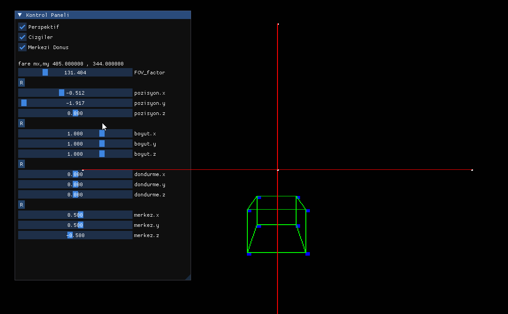


<h2> </h2>
ucgenler ile kup cizimi

<h2> </h2>

- koordinat duzlemini yazmayi unutma x-y-z sag-sol el kurali
- dondurme
- indeks tamponu ekle
- obj dosya okuyucu
- main yapisini tasi
- derinlik siralamasi
- eski legacy opengl ile baglantiyi anlat 