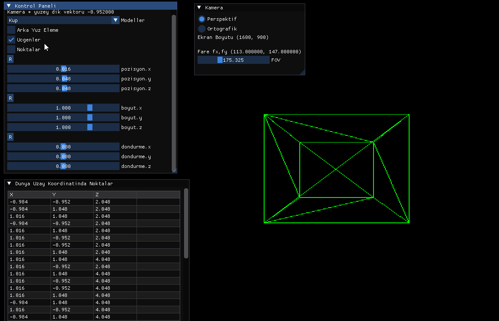
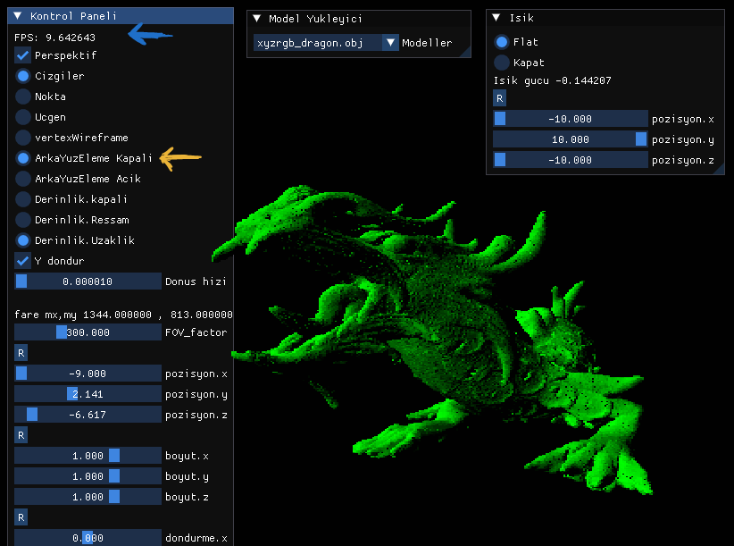
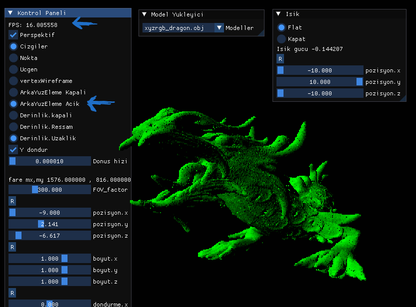
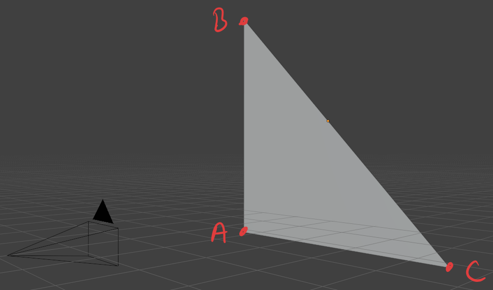
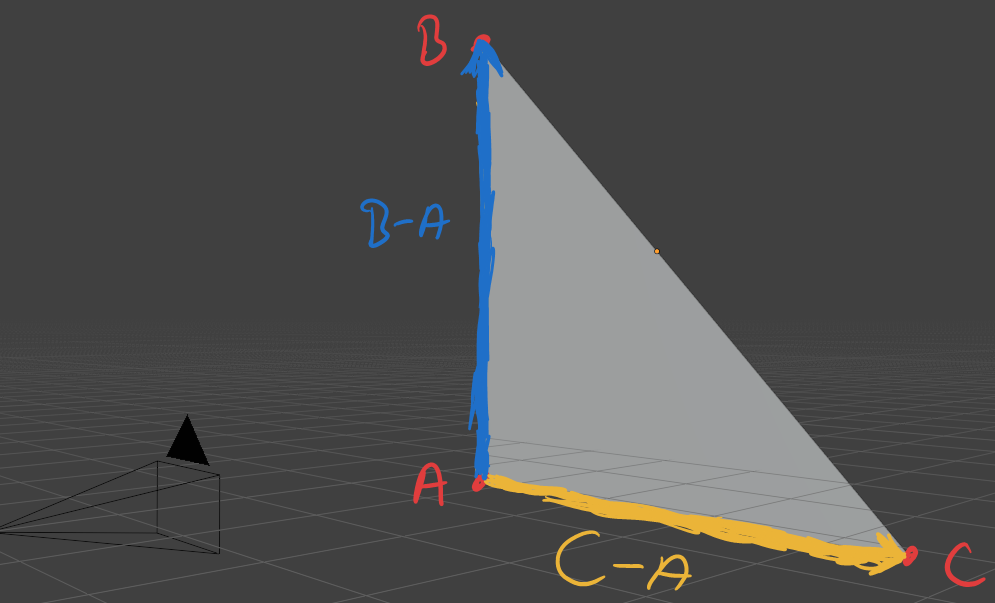
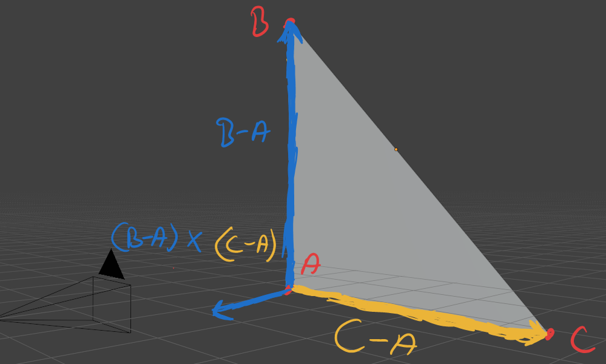
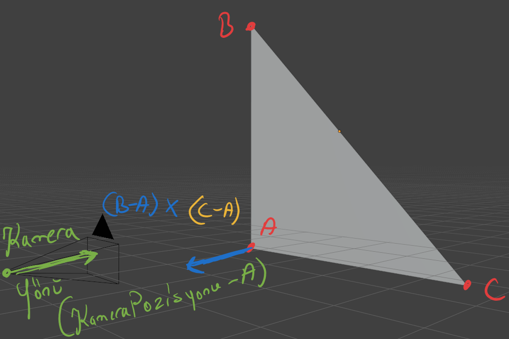
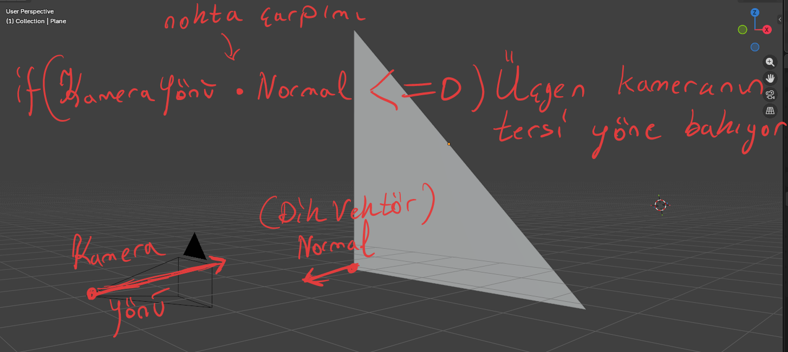
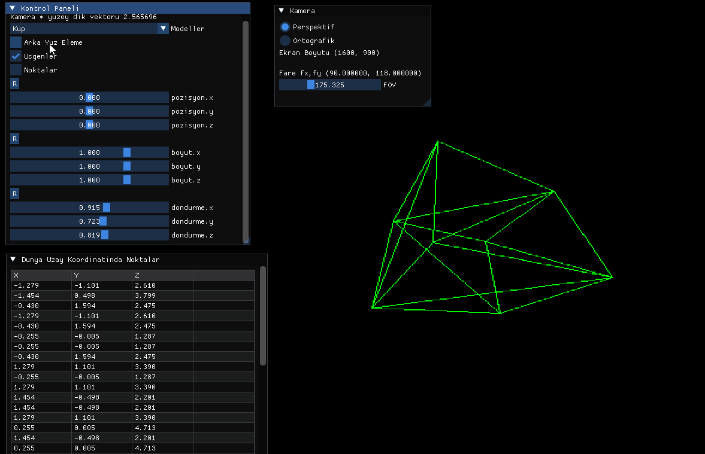

kodu duzelt?

<h2>Arka Yuz Eleme</h2>

Simdi kupu ciziyoruz iyi guzelde, bu kupun arkada kalan ucgenlerinide cizim sistemine yolluyoruz bosa dongu donuyor ve ilerde binlerce ucgene sahip modeller yukleyecegiz ornegin xyz_dragon.obj [modeller](https://github.com/alecjacobson/common-3d-test-models) ~800.000 ucgen. 





Evet yaklasik ~3-4 fps kurtarma operasyonuna baslayalim(bu kadar dusuk fps olmasinin sebebi tek cekirdek uzerinde donuyor program)




- Karenin bir ucgenini alip kenara cekelim kose noktalari ABC olsun
```cpp
    Vector3 vectorA = transformedPoints[0];
    Vector3 vectorB = transformedPoints[1];
    Vector3 vectorC = transformedPoints[2];
```




- A noktasindan B noktasina giden vektoru B-A yi hesaplayalim
- Ayni sey C-A icinde yapalim

```cpp
    Vector3 vectorAB = vectorB - vectorA;
    Vector3 vectorAC = vectorC - vectorA;
```      


- Ucgene dik(normal) vektoru capraz carpim ile buluyoruz 
- Uzunluguna ihtiyacimiz olmadigi icin birim vektor hale getiriyoruz
  
  Elimizdeki bu normal vektor ucgenin neresinin DIS YUZEY oldugunu bildirmekte

```cpp
    Vector3 normal = vectorAB.cross(vectorAC);
    normal.normalize();
```
        


```cpp
    Vector3 cameraRay = camera.position - vectorA;
```



```cpp
    dotNormalCamera = normal.dot(cameraRay);
    if (cullmode == CullMode::ACTIVE)
    {
        if (dotNormalCamera <= 1)
        {
            continue;
        }
    }
```
<h2> Sonuc </h2>


