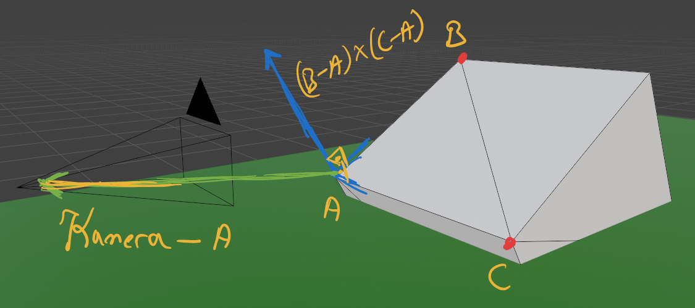
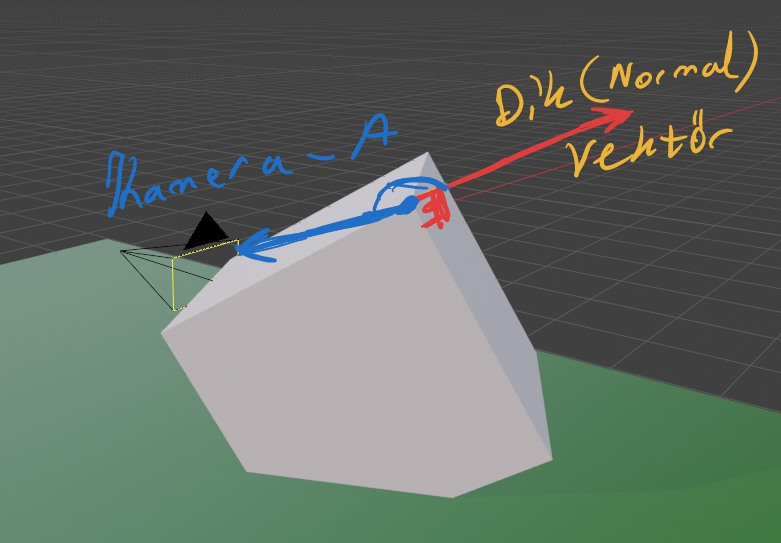

- modelPoints: noktalarimizin tutuldugu dizi ~(OpenGL VBO)
- meshFaces: noktalar arasindaki baglantilarin tutuldugu dizi ~(OpenGL IBO)

```cpp

void loadCube(std::vector<Vector3>& modelPoints, std::vector<Face>& meshFaces)
{
    /*
            (-1,1,1) ----------- (1,1,1)
               /|                  /|
              / |                 / |
             /  |                /  |
    (-1,1,-1)-----------(1,1,-1)    |
            |   |               |   |
            |   |               |   |
            |   |               |   |
            |   |               |   |
            |  (-1,-1,1)--------|---(1,-1,1)
            |  /                |  /
            | /                 | /
            |/                  |/
    (-1,-1,-1) ----------- (1,-1,-1)


            6 ----------- 4
           /|            /|
          / |           / |
         1 ----------- 2  |
         |  |          |  |
         |  7 ---------|--5
         | /           | /
         |/            |/
         0 ----------- 3

    */

    modelPoints.emplace_back(-1, -1, -1);  // 0
    modelPoints.emplace_back(-1, 1, -1);  // 1
    modelPoints.emplace_back(1, 1, -1);  // 2
    modelPoints.emplace_back(1, -1, -1);  // 3
    modelPoints.emplace_back(1, 1, 1);  // 4
    modelPoints.emplace_back(1, -1, 1);  // 5
    modelPoints.emplace_back(-1, 1, 1);  // 6
    modelPoints.emplace_back(-1, -1, 1);  // 7

    // front
    meshFaces.emplace_back(0, 1, 2);
    meshFaces.emplace_back(0, 2, 3);

    // right
    meshFaces.emplace_back(3, 2, 4);
    meshFaces.emplace_back(3, 4, 5);

    // back
    meshFaces.emplace_back(5, 4, 6);
    meshFaces.emplace_back(5, 6, 7);

    // left
    meshFaces.emplace_back(7, 6, 1);
    meshFaces.emplace_back(7, 1, 0);

    // top
    meshFaces.emplace_back(1, 6, 4);
    meshFaces.emplace_back(1, 4, 2);

    // bottom
    meshFaces.emplace_back(5, 7, 0);
    meshFaces.emplace_back(5, 0, 3);
}

```

<h2>Arka Yuz Eleme</h2>

Simdi kupu ciziyoruz iyi guzelde, bu kupun arkada kalan ucgenlerinide cizim sistemine yolluyoruz bosa dongu donuyor ve ilerde binlerce ucgene sahip modeller yukleyecegiz ornegin xyz_dragon.obj [modeller](https://github.com/alecjacobson/common-3d-test-models) ~800.000 ucgen. 


Evet yaklasik ~5-6 fps kurtarma operasyonuna baslayalim

Bu kadar dusuk fps olmasinin sebebi tek cekirdek uzerinde donuyor program, Release modunda derleniyor ve ~4 fps derinlik algoritmasina gidiyor ilerde daha iyi bir yontem olan z buffer ekliyecegiz


- Karenin bir ucgenini alip kenara cekelim kose noktalari ABC olsun
```cpp
    Vector3 vectorA = transformedPoints[0];
    Vector3 vectorB = transformedPoints[1];
    Vector3 vectorC = transformedPoints[2];
```


- A noktasindan B noktasina giden vektoru B-A yi hesaplayalim
- Ayni sey C-A icinde yapalim

```cpp
    Vector3 vectorAB = vectorB - vectorA;
    Vector3 vectorAC = vectorC - vectorA;
```      


- Ucgene dik(normal) vektoru capraz carpim ile buluyoruz 
- Uzunluguna ihtiyacimiz olmadigi icin birim vektor hale getiriyoruz
  
  Elimizdeki bu normal vektor ucgenin neresinin DIS YUZEY oldugunu bildirmekte

```cpp
    Vector3 normal = vectorAB.cross(vectorAC);
    normal.normalize();
```
        


- A Noktasindan kameraya dogru bakan vektoru buluyoruz

```cpp
    Vector3 cameraRay = camera.position - vectorA;
```



- Ucgene dik olan(normal) vektor ile A dan kameraya dogru bakan vektor arasinda nokta carpimi yapiyoruz

- Eger carpim negatif ise ucgen kameraya ters veya dik durmaktadir

```cpp
    //dontNormalCamera => global float
    dotNormalCamera = normal.dot(cameraRay);
    if (cullmode == CullMode::ACTIVE)
    {
        if (dotNormalCamera < 0)  
        {
            continue;
        }
    }
```
<h2> Sonuc </h2>

5 FPS kurtarildi!

**Arka yuz eleme algoritmasi**
```cpp
    Vector3 vectorA = transformedPoints[0];
    Vector3 vectorB = transformedPoints[1];
    Vector3 vectorC = transformedPoints[2];

    Vector3 vectorAB = vectorB - vectorA;
    Vector3 vectorAC = vectorC - vectorA;

    Vector3 normal = vectorAB.cross(vectorAC);
    normal.normalize();

    Vector3 cameraRay = camera.position - vectorA;

    dotNormalCamera = normal.dot(cameraRay);

    if (cullmode == CullMode::ACTIVE)
    {
        if (dotNormalCamera <= 1)
        {
            continue;
        }
    }

```


