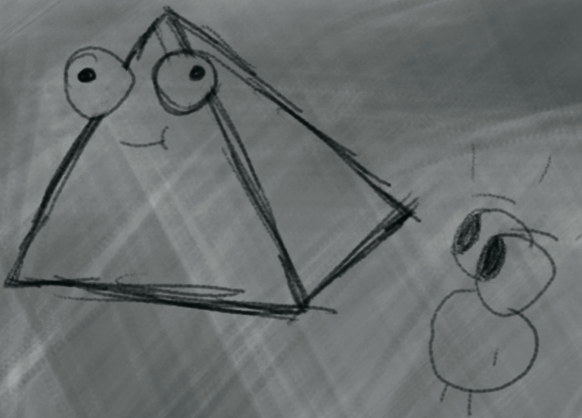
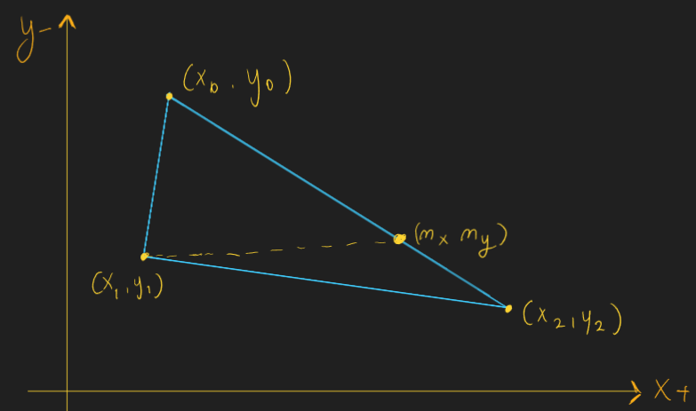
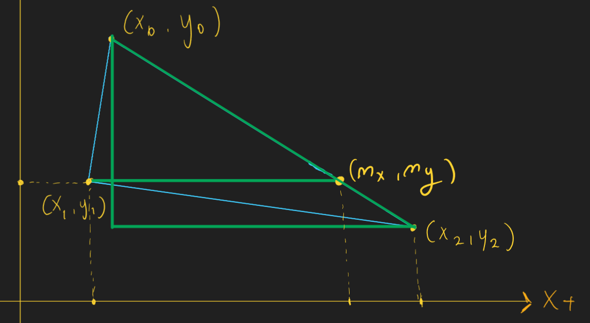
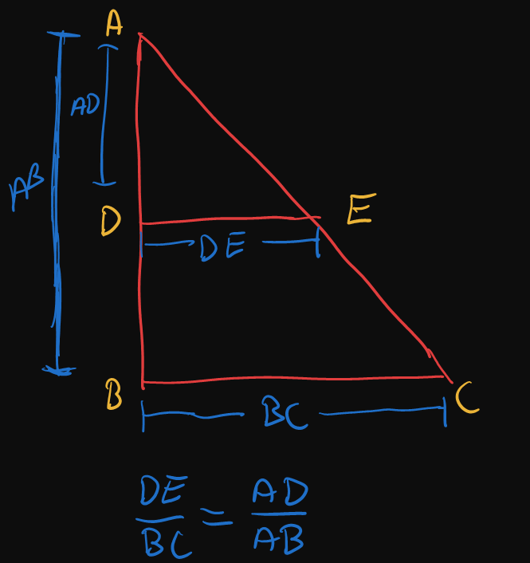
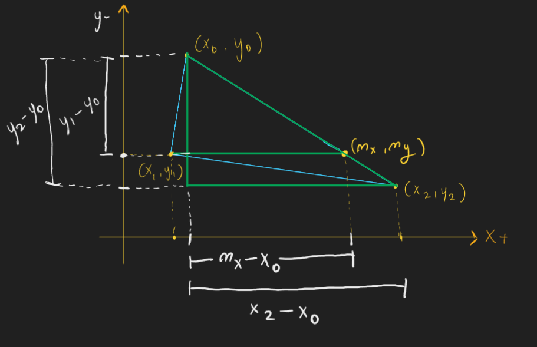
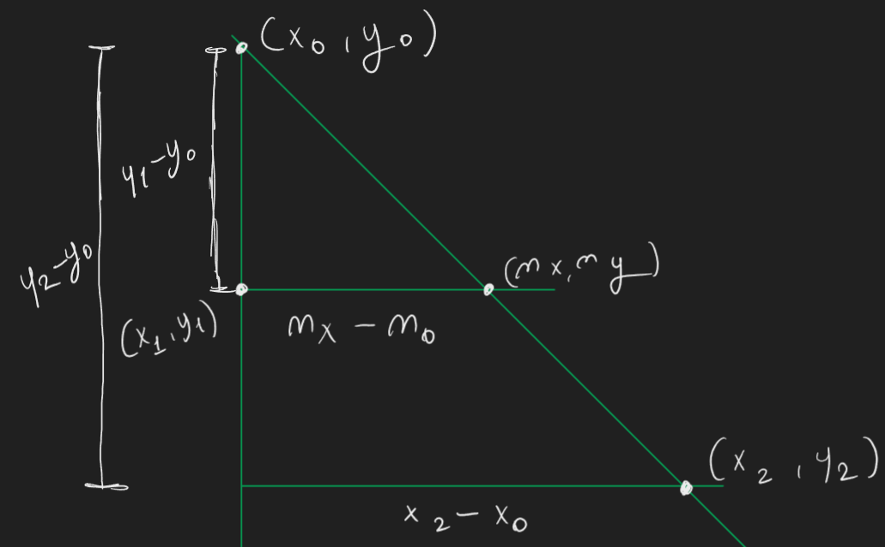
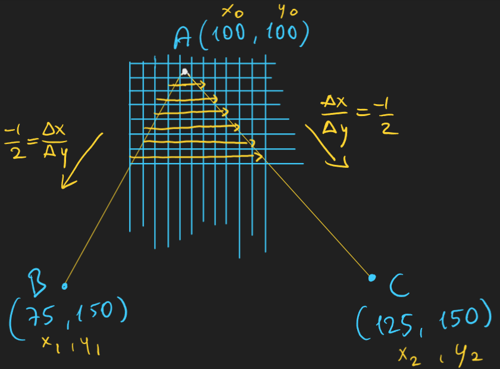
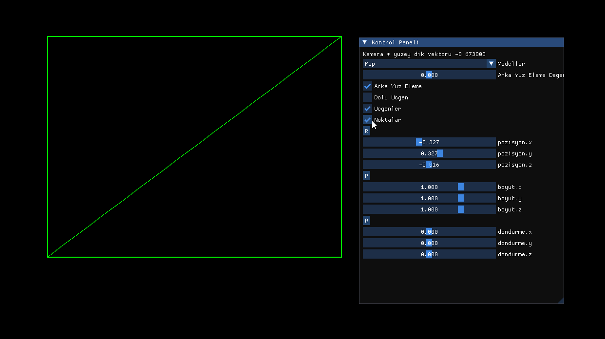

<h2>Ici Dolu Ucgen Cizimi</h2>

kodu unutma

```cpp
void drawTriangle
(
int x0, int y0, 
int x1, int y1, 
int x2, int y2, 
Color_t color
);
```

Kullanicagimiz algoritma flat top-bottom olucak

Girdimiz


$$
\Large v_0 (100,100)
$$
$$
\Large v_1 (150,200)
$$
$$
\Large v_2 (75, 150)
$$

1. Ucgenin noktalarini y pozisyonuna gore siraliyoruz
    
    y0 < y1 < y2

```cpp

void Graphics::swap(int& a, int& b)
{
    int temp = a;
    a = b;
    b = temp;
}

void Graphics::drawFilledTriangle
(
    int x0, int y0, 
    int x1, int y1, 
    int x2, int y2, 
    Color_t color
)

{    

    if (y0 > y1)
    {        
        swap(y0, y1);
        swap(x0, x1);
    }
    if (y1 > y2)
    {
        swap(y1, y2);
        swap(x1, x2);
    }
    if (y0 > y1)
    {
        swap(y0, y1);
        swap(x0, x1);
    }
    ...
    ...
```

$$
\Large v_0 (100,100)
$$
$$
\Large v_1 (75, 150)
$$
$$
\Large v_2 (150,200)
$$

2. Ucgenin ikiye bolucegimiz kesim noktasini(mx, my) buluyoruz





Perspektifte oldugu gibi ucgende benzerligin gucu ile mx noktasini buluyoruz
my ise y1 e esit

**Ucgende Benzerlik**


<h2> </h2>




**Temiz hali**


<h2> </h2>

$$
\Large
\frac{m_x - x_0}{x_2 - x_0} = \frac{y_1 - y_0}{y_2 - y_0}
$$

<h2> </h2>

$$
\Large
m_x - x_0 = \frac{(x_2 - x_0)(y_1 - y_0)}{y_2 - y_0}
$$

<h2> </h2>

$$
\Large
m_x = \frac{(x2 - x0) * (y1 - y0)}{(y2 - y0) } + x0
$$

<h2> </h2>

$$
\Large m_y = y_1
$$

<h2> </h2>

$$
\Large
m_x = \frac{(150 - 100)(150 - 100)}{200 - 100} + 100
$$

<h2> </h2>


$$
\Large
m_x = 125
$$
$$
\Large
m_y = 150
$$

<h2> </h2>


```cpp
 int my = y1;
 int mx = ((float)((x2 - x0) * (y1 - y0)) / (float)(y2 - y0)) + x0;

fillFlatBottomTriangle(x0, y0, x1, y1, mx, my, color);

fillFlatTopTriangle(x1, y1, mx, my, x2, y2, color);

```

<h2>  </h2>

```cpp
void Graphics::fillFlatBottomTriangle(int x0, int y0, int x1, int y1, int x2, int y2, Color_t color)
{ 
    float invSlopeLeft = (float)(x1 - x0) / (y1 - y0);
    float invSlopeRight = (float)(x2 - x0) / (y2 - y0);

    float startx = x0;
    float endx = x0;

    for (int y = y0; y <= y2; y++)
    {
        drawLine(startx, y, endx, y, color);

        startx += invSlopeLeft;
        endx += invSlopeRight;
    }
}
```
1. Ters egimleri hesapliyoruz 



```cpp
void Graphics::fillFlatBottomTriangle(int x0, int y0, int x1, int y1, int x2, int y2, Color_t color)
{
    float invSlopeLeft = (float)(x1 - x0) / (y1 - y0);
    float invSlopeRight = (float)(x2 - x0) / (y2 - y0);

    ...
```
4. Bu egim degerlerini kullanarak AB AC kenarlari arasinda cizgi ciziyoruz

```cpp
    float startx = x0;
    float endx = x0;

    //for(y = A.y; y <= C.y; y++)
    for (int y = y0; y <= y2; y++)
    {
        drawLine(startx, y, endx, y, color);

        startx += invSlopeLeft;
        endx += invSlopeRight;
    }
}
```
5. Ayni isleminin tersini alt ucgen icin uyguluyoruz

```cpp
void Graphics::fillFlatTopTriangle(int x0, int y0, int x1, int y1, int x2, int y2, Color_t color)
{
    float invSlopeLeft =  (float)(x2 - x0) / (y2 - y0);
    float invSlopeRight = (float)(x2 - x1) / (y2 - y1);

    float startx = x2;
    float endx = x2;

    for (int y = y2; y >= y0; y--)
    {
        drawLine(startx, y, endx, y, color);

        startx -= invSlopeLeft;
        endx -= invSlopeRight;
    }
}
```

Bu fonksiyonu cagirip izdusumu alinmis noktalardan ici dolu ucgenleri cizdirelim

```cpp
void draw()
{

    ...

    for (size_t i = 0; i < renderTrigs.size(); i++)
    {
        Triangle trig = renderTrigs[i];

        if ((renderMod & RenderMod::RenderMode_Triangle_Filled) == RenderMod::RenderMode_Triangle_Filled)
        {
            gp.drawFilledTriangle(
                trig.points[0].x, trig.points[0].y,
                trig.points[1].x, trig.points[1].y,
                trig.points[2].x, trig.points[2].y,
                Color::GREEN
            );
        }

    ...
```



