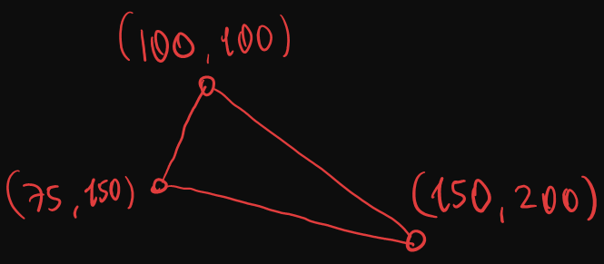

<h2>Ici Dolu Ucgen Cizimi</h2>

kodu unutma

```cpp
void drawTriangle
(
int x0, int y0, 
int x1, int y1, 
int x2, int y2, 
Color_t color
);
```

Kullanicagimiz algoritma flat top-bottom olucak

Girdimiz



$$
\Large
 v_0 (100,100)\\
 v_1 (150,200)\\
 v_2 (75, 150)
$$

1. Ucgenin noktalarini y pozisyonuna gore siraliyoruz
    
    y0 < y1 < y2

```cpp

void Graphics::swap(int& a, int& b)
{
    int temp = a;
    a = b;
    b = temp;
}

void Graphics::drawFilledTriangle
(
    int x0, int y0, 
    int x1, int y1, 
    int x2, int y2, 
    Color_t color
)

{    

    if (y0 > y1)
    {        
        swap(y0, y1);
        swap(x0, x1);
    }
    if (y1 > y2)
    {
        swap(y1, y2);
        swap(x1, x2);
    }
    if (y0 > y1)
    {
        swap(y0, y1);
        swap(x0, x1);
    }
    ...
    ...
```

$$
\Large
 v_0 (100,100)\\
 v_1 (75, 150)\\
 v_2 (150,200)
$$

2. Ucgeni ortadan ust ve alt olmak uzere $\Large v_1$ noktasinda boluyoruz. Olusan bu iki ucgeni sirasiyla verilen renk ile dolduruyoruz

$$
\Large
\frac{(x2 - x0) * (y1 - y0)}{(y2 - y0) + x0}
$$

```cpp
 int my = y1;
 int mx = ((float)((x2 - x0) * (y1 - y0)) / (float)(y2 - y0)) + x0;

fillFlatBottomTriangle(x0, y0, x1, y1, mx, my, color);

fillFlatTopTriangle(x1, y1, mx, my, x2, y2, color);

```

<h2> Ust Ucgen </h2>

```cpp
void Graphics::fillFlatBottomTriangle(int x0, int y0, int x1, int y1, int x2, int y2, Color_t color)
{
    float invSlopeLeft = (float)(x1 - x0) / (y1 - y0);
    float invSlopeRight = (float)(x2 - x0) / (y2 - y0);

    float startx = x0;
    float endx = x0;

    for (int y = y0; y <= y2; y++)
    {
        drawLine(startx, y, endx, y, color);

        startx += invSlopeLeft;
        endx += invSlopeRight;
    }
}
```
1. Ters egimleri hesapliyoruz

```cpp
void Graphics::fillFlatBottomTriangle(int x0, int y0, int x1, int y1, int x2, int y2, Color_t color)
{
    float invSlopeLeft = (float)(x1 - x0) / (y1 - y0);
    float invSlopeRight = (float)(x2 - x0) / (y2 - y0);

    ...
```

2. Asagi dogru AC AD bacaklarindan asagi dogru cizgi ciziyoruz

```cpp
    float startx = x0;
    float endx = x0;

    for (int y = y0; y <= y2; y++)
    {
        drawLine(startx, y, endx, y, color);

        startx += invSlopeLeft;
        endx += invSlopeRight;
    }
```
