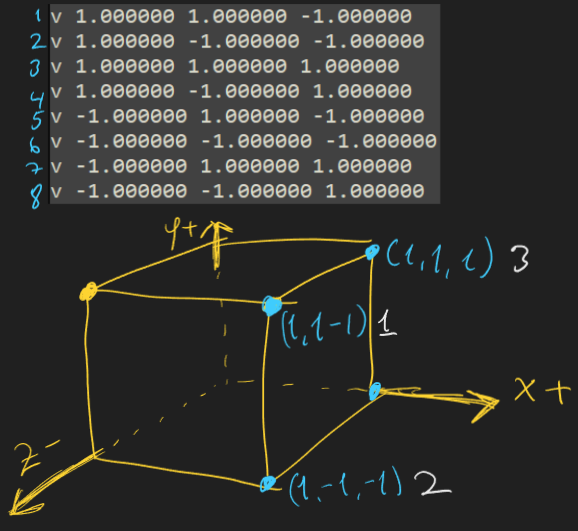
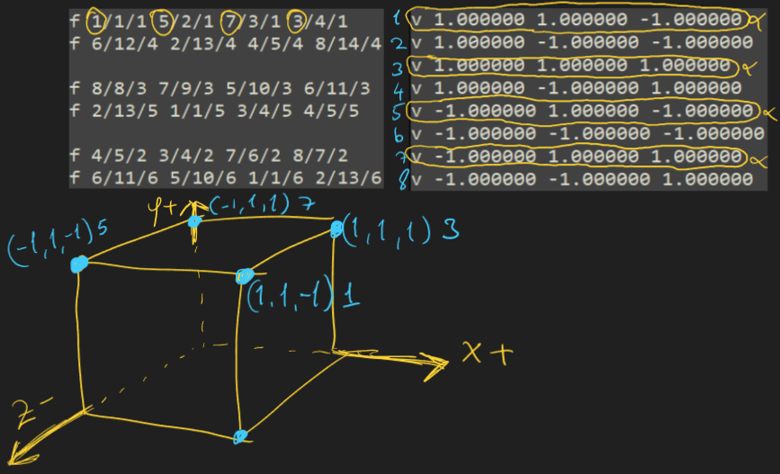
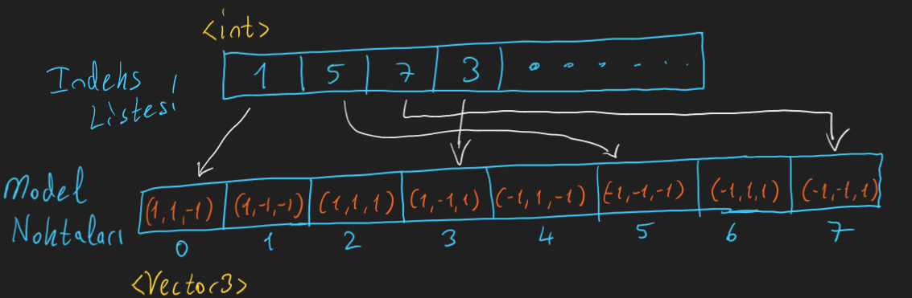

- v: Model noktalari
- vn: Model normalleri(arka yuz elemede hesapladigimiz yuzeye dik olan vektorler)
- vt: Kaplama koordinatlari
- f: Model noktalarinin baglanti(yuz[face]) indeksleri





- f: v/vt/vn

v:  model noktalarinin indeksleri

Bu ikisini okumayacagiz su anlik gereksiz

vt: kaplama indeksleri

vn: normal indeksleri




<h2> </h2>

```cpp
class ObjReader
{
public:
	ObjReader();
	~ObjReader();

    void read(std::string path);
	
    //Model noktalari
	std::vector<Vector3> vertices;

    //Indeks listesi
	std::vector<Face> faces;
private:
    int parseIndex(std::string& str);
};
```

```cpp
void ObjReader::read(std::string path)
{
    //Listeleri temizliyoruz
    vertices.clear();
    faces.clear();

    std::ifstream file(path);    

    std::string line;
    
    while (std::getline(file, line))
    {
        std::stringstream ss(line);
        std::string prefix;
        ss >> prefix;

        //Nokta verileri => Nokta listesi
        if (prefix == "v")
        {
            Vector3 vec;
            ss >> vec.x >> vec.y >> vec.z;
            vertices.push_back(vec);
        }
        else if (prefix == "f")
        {
            Face face;
            std::string a, b, c, d;
            
            std::string temp;
            
            std::vector<std::string> vertexIndexList;
            while (ss >> temp)
            {
                vertexIndexList.push_back(temp);
            }


            std::vector<int> indexList;
            for (auto& element : vertexIndexList)
            {
                indexList.push_back(parseIndex(element) - 1);
            }
            /*
            v0 v1 v2
            v0 v2 v3
            v0 v3 v4
            v0 v4 v5
            v0 v5 v6
            v0 v6 v7
            */                        
            for (size_t i = 0; i < indexList.size() - 2; i++)
            {
                int f1 = indexList[0];
                int f2 = indexList[i + 1];
                int f3 = indexList[i + 2];
                
                faces.push_back({ f1, f2, f3 });
            }
            
                        
        }
    }   
}

int ObjReader::parseIndex(std::string& str)
{
    std::stringstream ss(str);
    int index;
    ss >> index;
    return index;
}
```

```cpp
void loadObjModel(std::string model)
{
    objr.read(cmake_PROJECT_RES + model);

    modelPoints = objr.vertices;
    meshFaces = objr.faces;

    renderTrigs.clear();
    renderTrigs.resize(meshFaces.size());
}
```