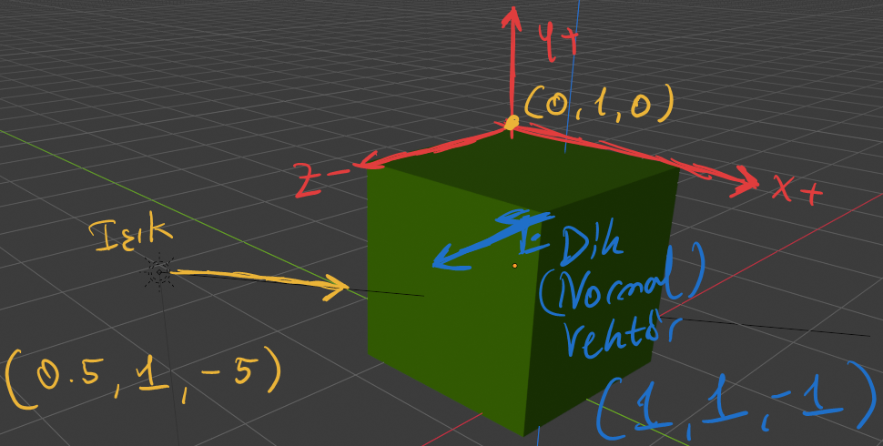
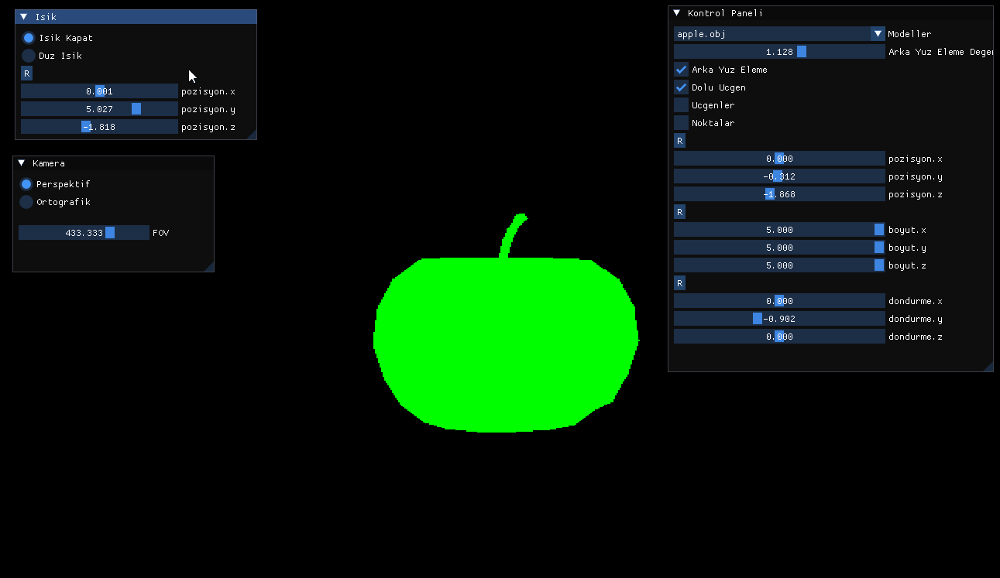

Temel mantik kisaca modelin dik(normal) vektoru ile isik yonu arasinda nokta carpimi pozitif ise yuzeyin rengi daha acik olur aradaki aci kuculdukce yuzey rengi kararir


$$
\large Isik(0.5, 1, -5)
$$
$$
\large Dik(1,1,-1)
$$
$$
\large 0.5*1 + 1*1 +(-5)(-1)
$$
$$
\large 6.5
$$

***Application.cpp***
```cpp
void update()
{
    ...
    ...

    //--isik---

    light.m_direction = appState.m_lightPos;

    light.m_direction.normalize();

    float intensityFactor = normal.dot(light.m_direction);

    //---------
    
    if (appState.m_lightMod == LightMod::FLAT)
    {
        projectedTrig.color = light.applyLighting(0xff00'ff00, intensityFactor);
    }
    else if (appState.m_lightMod == LightMod::NONE)
    {
        projectedTrig.color = 0xff00'ff00;
    }

    ...
    ...
}
```

***Light.cpp***
```cpp
Color_t Light::applyLighting(Color_t color, float intensity)
{
    if (intensity < 0.0f)
    {
        intensity = 0.0f;
    }
    if (intensity > 1.0f)
    {
        intensity = 1.0f;
    }

    /*
    |-----32 bit----|
    .---------------.
    | A | R | G | B |
    .---------------.
    | 8 | 8 | 8 | 8 |
    .---------------.

    */

    uint8_t a = (color >> 24) & 0xFF;
    uint8_t r = (color >> 16) & 0xFF;
    uint8_t g = (color >> 8) & 0xFF;
    uint8_t b = (color >> 0) & 0xFF;

    r = static_cast<uint8_t>(r * intensity);
    g = static_cast<uint8_t>(g * intensity);
    b = static_cast<uint8_t>(b * intensity);

    return (a << 24) | (r << 16) | (g << 8) | b;
}
```


<h2> </h2>

Isik yapisi

***Light.cpp***
```cpp
#pragma once

#include "math/Vector3.h"

#include "Defs.h"

class Light
{
public:
	Light(Vector3 direction);
	~Light();

	Color_t applyLighting(Color_t color, float intensity);

	Vector3 m_direction;
private:

};
```


***Application.cpp***
```cpp
Application::Application()
    :
    gp(rcontext),
    light({0,0,-2})
{
}
```


***Triangle.h***
```cpp
struct Triangle
{
    Vector2 points[3];
    //renk eklendi
    Color_t color;
};
```

<h2> </h2>

