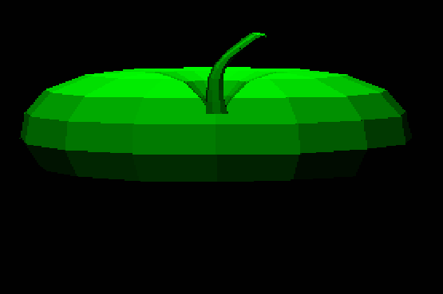
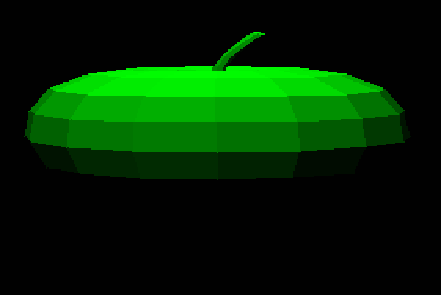

Cizim sistemi suan ucgenlerin derinligini(z koordinatini) gormezden gelip veriyi dumduz ekrana yansitmakta bundan dolayi arkada olmasi gereken ucgenler on tarafta cizilmekte.

```cpp
void draw()
{
    for (size_t i = 0; i < renderTrigs.size(); i++)
    {
        Triangle trig = renderTrigs[i];

        if ((appState.m_renderMod & RenderMod::RenderMode_Triangle_Filled) == RenderMod::RenderMode_Triangle_Filled)
        {
            gp.drawFilledTriangle(
                trig.points[0].x, trig.points[0].y,
                trig.points[1].x, trig.points[1].y,
                trig.points[2].x, trig.points[2].y,
                trig.color
            );
        }
    ...
    }
}

```

<h2>Ressam Algoritmasi</h2>

Yapicagimiz sey ucgenleri en uzaktan yakina dogru siralayip cizmek (diger cozumler ise Z-buffer, bsp vb. [3D Rendering with Binary Space Partitions](https://www.youtube.com/watch?v=yTRzfKh4Tg0&t=231s))


- Ucgenin z koordinatlarinin ortalamasi

```cpp
if (appState.m_depthTest == DepthTest::PAINTER_AVERAGE)
{
    projectedTrig.depthTestValue = (vectorA.z + vectorB.z + vectorC.z) / 3;
}
```

- Agirlik merkezinden kameraya olan uzaklik ile siralama

```cpp
else if (appState.m_depthTest == DepthTest::PAINTER_DISTANCE)
{
    Vector3 trigCenter;
    trigCenter.x = (vectorA.x + vectorB.x + vectorC.x) / 3;
    trigCenter.y = (vectorA.y + vectorB.y + vectorC.y) / 3;
    trigCenter.z = (vectorA.z + vectorB.z + vectorC.z) / 3;

    Vector3 distance;
    distance = trigCenter - appState.m_camera.position;
    projectedTrig.depthTestValue = distance.x * distance.x + distance.y * distance.y + distance.z * distance.z;
}
```



```cpp
    void update()
    {
        for(size_t i = 0; i < meshFaces.size(); i++)
        {
            ...

            Vector3 vectorA = transformedPoints[0];
            Vector3 vectorB = transformedPoints[1];
            Vector3 vectorC = transformedPoints[2];

            ...
            ...

            //---Derinlik---/
            if (appState.m_depthTest == DepthTest::PAINTER_AVERAGE)
            {
                projectedTrig.depthTestValue = (vectorA.z + vectorB.z + vectorC.z) / 3;
            }
            else if (appState.m_depthTest == DepthTest::PAINTER_DISTANCE)
            {
                Vector3 trigCenter;
                trigCenter.x = (vectorA.x + vectorB.x + vectorC.x) / 3;
                trigCenter.y = (vectorA.y + vectorB.y + vectorC.y) / 3;
                trigCenter.z = (vectorA.z + vectorB.z + vectorC.z) / 3;

                Vector3 distance;

                distance = trigCenter - appState.m_camera.position;

                projectedTrig.depthTestValue = distance.x * distance.x + distance.y * distance.y + distance.z * distance.z;
            }

            renderTrigs.emplace_back(projectedTrig);
        

            if (appState.m_depthTest == DepthTest::PAINTER_AVERAGE ||
                appState.m_depthTest == DepthTest::PAINTER_DISTANCE)
            {
                std::sort(renderTrigs.begin(), renderTrigs.end(),
                    [](const Triangle& a, const Triangle& b)
                    {
                        return a.depthTestValue > b.depthTestValue;
                    }
                );
            }
        }//for(...)
    }//void update()
```
<h2>Sonuc</h2>


