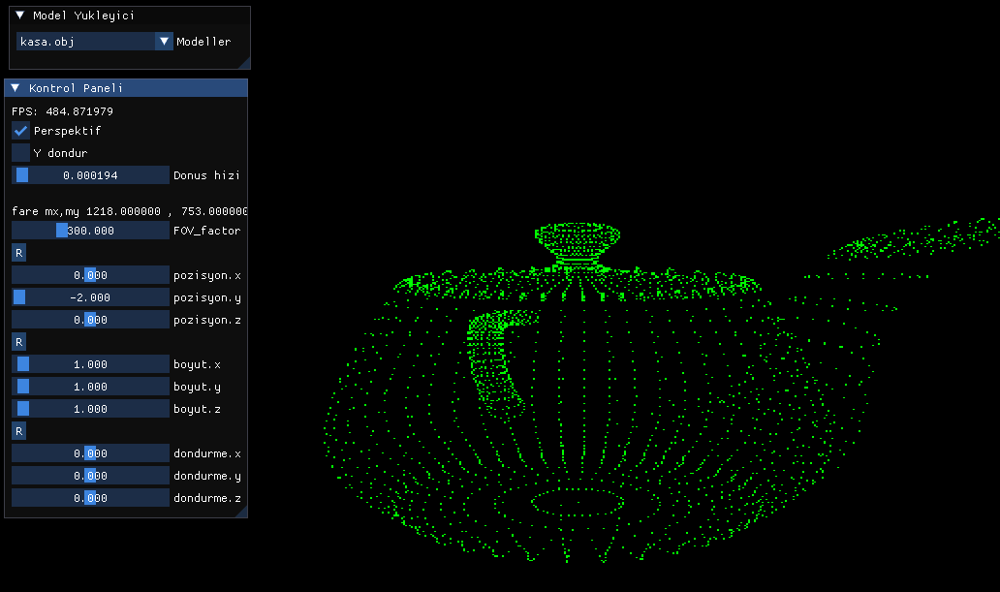

https://github.com/tinyobjloader/tinyobjloader/blob/release/tiny_obj_loader.h

yazmis oldugum obj dosya okuyucu pirtladi arka yuz eleme(backface culling) algoritmasi uygularken bazi yuzler gozukmuyor

obj yukleyicide hata var
#define FASTFLOAT_CONSTEXPR20
makroyu bosa aldim

// Testing for relevant C++20 constexpr library features
#if FASTFLOAT_HAS_IS_CONSTANT_EVALUATED && FASTFLOAT_HAS_BIT_CAST &&           \
    defined(__cpp_lib_constexpr_algorithms) &&                                 \
    __cpp_lib_constexpr_algorithms >= 201806L /*For std::copy and std::fill*/

//constexpr function 'fast_float::loop_parse_if_eight_digits' cannot result in a constant expression
//#define FASTFLOAT_CONSTEXPR20 constexpr
#define FASTFLOAT_CONSTEXPR20
#define FASTFLOAT_IS_CONSTEXPR 1
