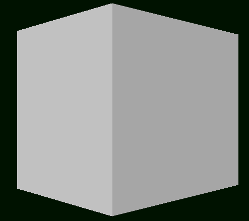

<h2>Amaç</h2> 
software renderer(yazılım tabanlı çizim) denilen zamazingoyu Türkçeye çevirmektir

\

<h2> </h2>

- [x] 00-Proje
- [x] 01-SDL kurulumu
- [ ] 02-kodu kontrol et

<h2> Eklenilecek | Duzeltilecek Basliklar</h2>

- Yazim hatalarini duzelt
- 00-Proje/Linux kismi eksik

- SDL Kurulumu
- Temel Yapi
- Cizgi Algoritmalari
- Vektorler
- Ucgen Cizimi
- Indeks Tamponu
- Perspektif
- OBJ Dosyasi
- Derinlik
- Kaplamalar
- GLM
- Isik
