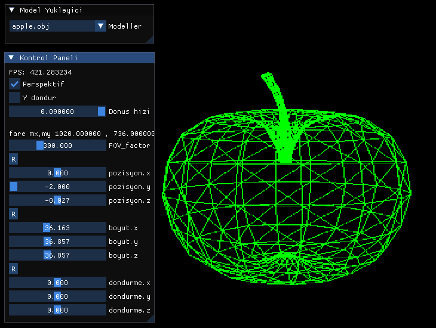

<h2>Amaç</h2> 
software renderer(yazılım tabanlı çizim) denilen zamazingoyu Türkçeye çevirmektir

...ne oldugunu acikla, half-life/quake/ eski oyunlardan ornekler yaz suraya

\

<h2> </h2>

- [x] 00-Proje  
- [x] 01-SDL kurulumu
- [x] 02-Temel yapi
- [x] 03-Piksel Cizimleri
- [x] 04-Cizgi Algoritmalari
- [x] 05-Temel Cizimler ve Yapi Guncellemesi
- [x] 06-Vektorler
- [x] 07-Donen Seyler
- [x] 08-Imgui
- [ ] 09-Perspektif ve Nokta Bulutu
- [ ] 10-Kup Cizimi
- [ ] 11-OBJ dosyasi
- [ ] 12-Delta-t (update(dt))

- bolum 2?

- [ ] 13-ObjLoader
- [ ] 14-Arka Yuzey Elemesi(Backface Culling)
- [ ] 15-Ici Dolu Ucgen Cizimi
- [ ] 16-Derinlik
- [ ] 17-Renkli Kup(Materyaller)
- [ ] 18-OpenGL ile Basit Cizimler
- [ ] 19-Isik
- [ ] 20-Kamera

- [ ] 12-ShaderToy ?
- [ ] 11-ImguiV0.2 (cmake guncelleme)
- [ ] 18-GLM
- [ ] 19-Kaplamalar

<h2> Eklenilecek | Duzeltilecek Basliklar</h2>

- kodlari kontrol et gereksiz kisimlari cikart
- baku/ dosyalarini atmayi unutma
- 06-Vektorler ornek ekle
- Yazim hatalarini duzelt
- 00-Proje/Linux kismi eksik
- 04-Cizgi Algoritmalari/ diger algoritmalari ekle
